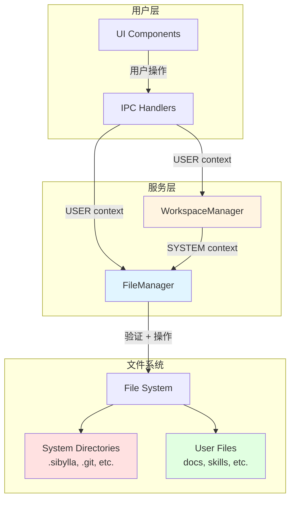
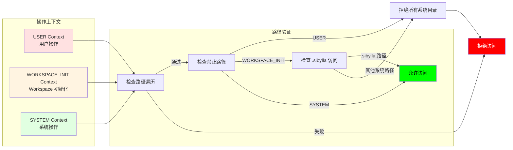
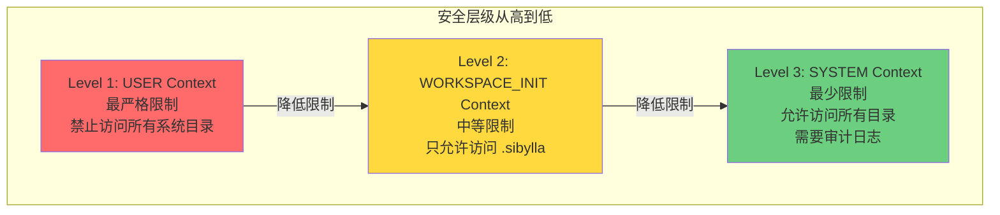
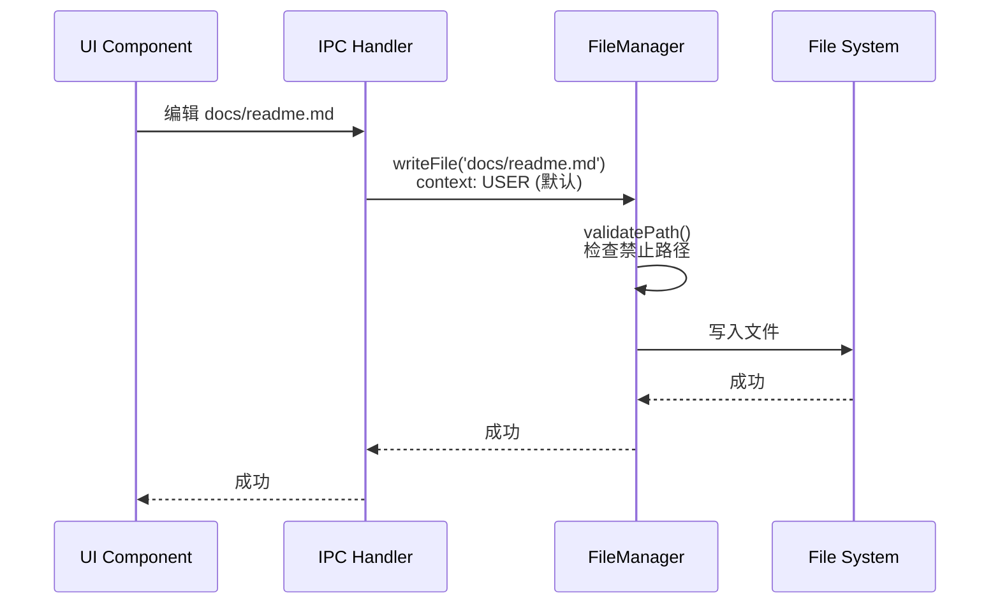
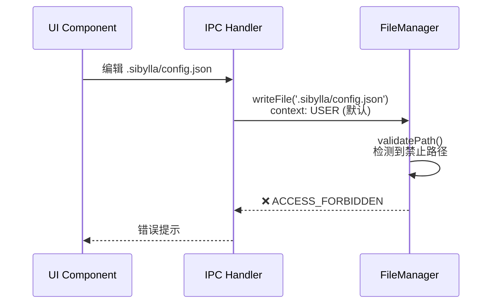
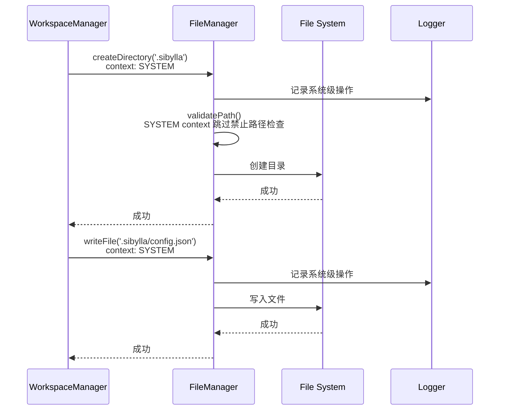
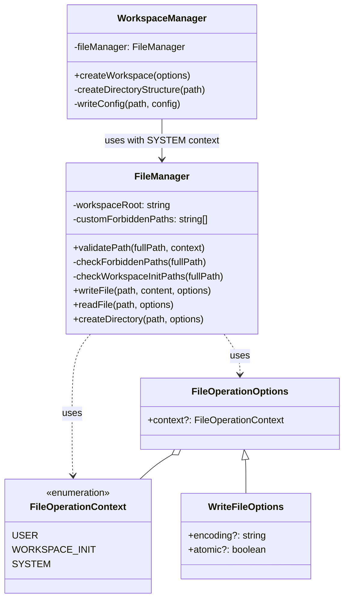
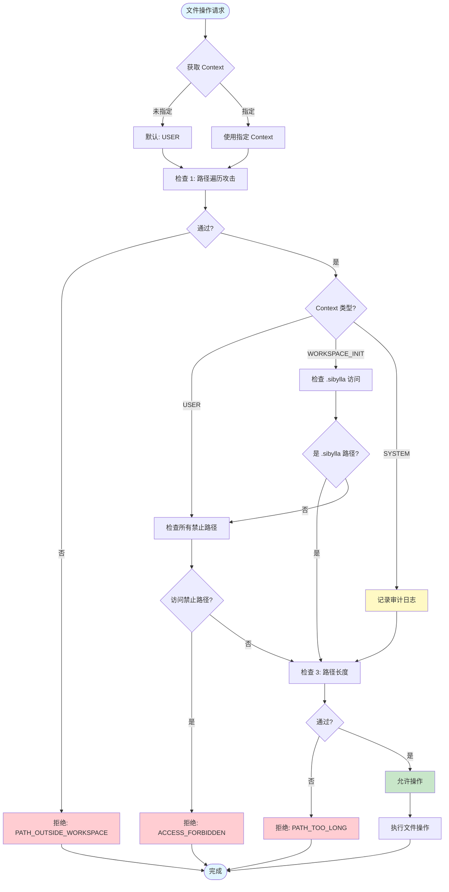

# FileManager 重构架构图

## 系统架构概览



## FileOperationContext 流程



## 安全层级



## 典型使用场景

### 场景 1: 用户编辑文档



### 场景 2: 用户尝试编辑系统文件（被拒绝）



### 场景 3: WorkspaceManager 创建 Workspace



## 代码结构



## 安全检查流程



## 测试覆盖矩阵

| Context | 路径类型 | 预期结果 | 测试用例 |
|---------|---------|---------|---------|
| USER | docs/readme.md | ✅ 允许 | ✓ |
| USER | .sibylla/config.json | ❌ 拒绝 | ✓ |
| USER | .git/config | ❌ 拒绝 | ✓ |
| USER | node_modules/pkg/index.js | ❌ 拒绝 | ✓ |
| WORKSPACE_INIT | .sibylla/config.json | ✅ 允许 | ✓ |
| WORKSPACE_INIT | .sibylla/index/data.json | ✅ 允许 | ✓ |
| WORKSPACE_INIT | .git/config | ❌ 拒绝 | ✓ |
| WORKSPACE_INIT | docs/readme.md | ✅ 允许 | ✓ |
| SYSTEM | .sibylla/config.json | ✅ 允许 + 日志 | ✓ |
| SYSTEM | .git/config | ✅ 允许 + 日志 | ✓ |
| SYSTEM | docs/readme.md | ✅ 允许 + 日志 | ✓ |
| (默认) | docs/readme.md | ✅ 允许 | ✓ |
| (默认) | .sibylla/config.json | ❌ 拒绝 | ✓ |

## 审计日志示例

```typescript
// SYSTEM context 操作会生成如下日志
{
  level: 'warn',
  message: '[FileManager] System-level operation',
  context: 'SYSTEM',
  path: '/workspace/.sibylla/config.json',
  operation: 'writeFile',
  timestamp: '2026-03-13T13:45:00.000Z',
  stack: 'Error\n    at FileManager.validatePath (...)\n    at WorkspaceManager.writeConfig (...)'
}
```

## 迁移路径

### 阶段 1: 类型定义（当前）
- 添加 `FileOperationContext` 枚举
- 添加 `FileOperationOptions` 接口

### 阶段 2: FileManager 重构
- 修改 `validatePath()` 支持 context
- 更新所有文件操作方法签名
- 添加审计日志

### 阶段 3: WorkspaceManager 重构
- 移除直接 fs 调用
- 使用 FileManager with SYSTEM context

### 阶段 4: 测试和验证
- 单元测试
- 集成测试
- 手动测试

### 阶段 5: 文档和发布
- 更新 API 文档
- 更新使用指南
- 代码审查

---

**创建时间:** 2026-03-13  
**最后更新:** 2026-03-13
