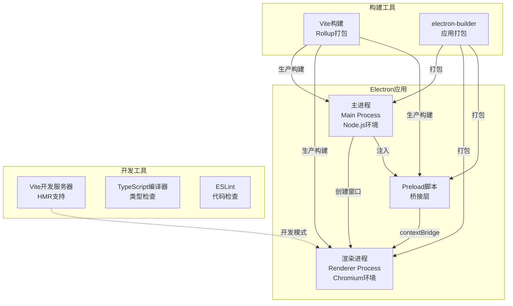
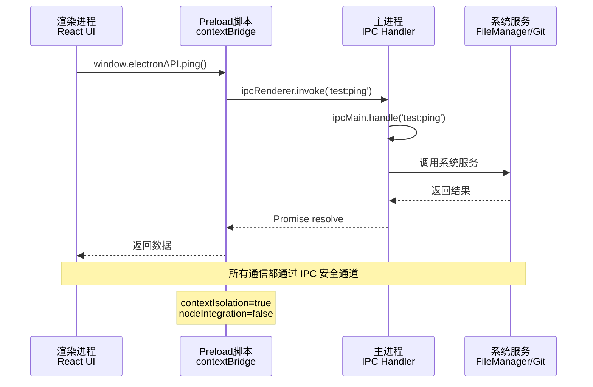
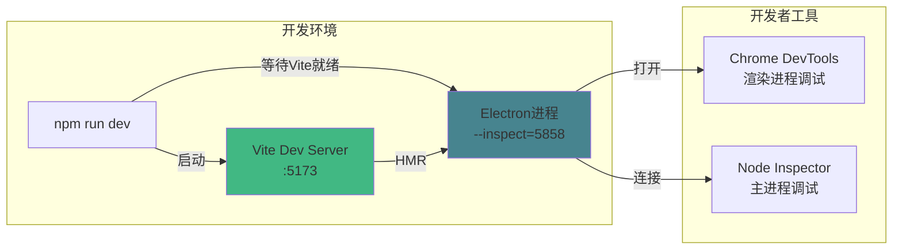
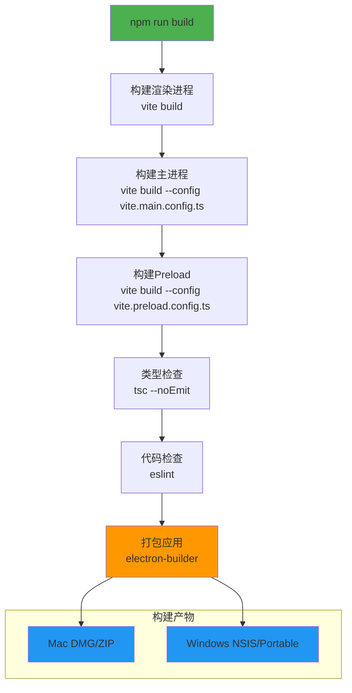
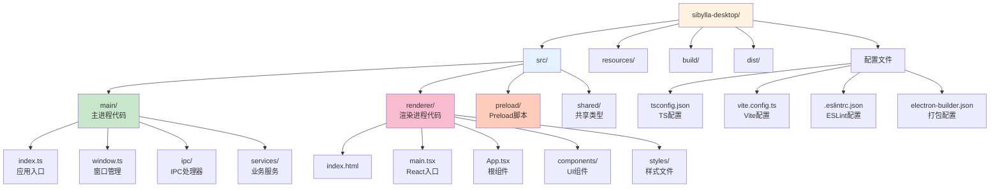
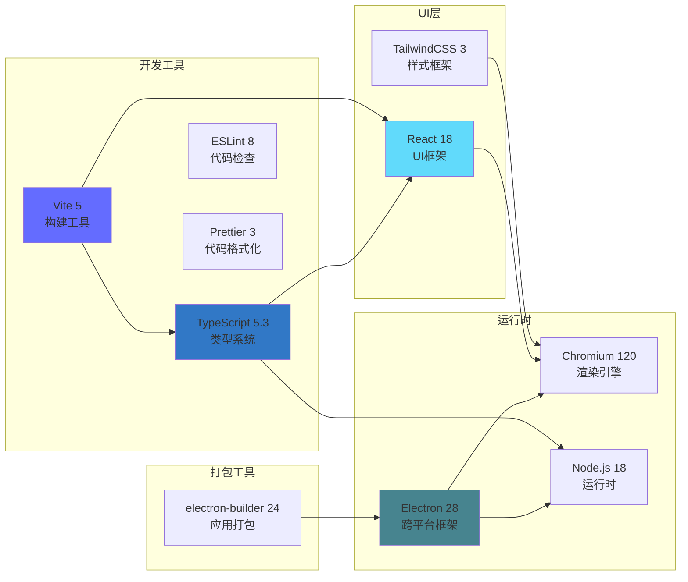
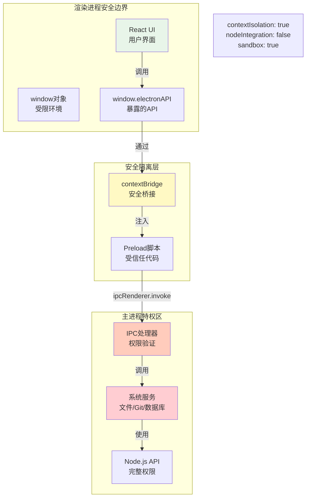
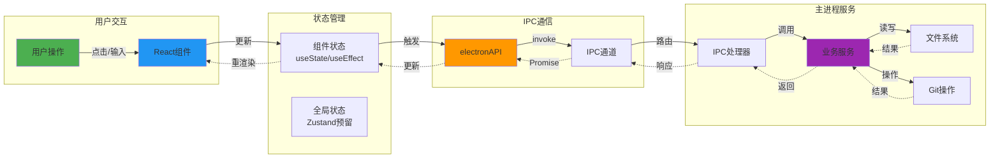

# Phase 0 Task 001 - 架构可视化

## 系统架构图

### 1. Electron 应用整体架构



### 2. 进程通信架构



### 3. 开发流程架构



### 4. 构建流程架构



### 5. 文件系统架构



### 6. 技术栈依赖关系



### 7. 安全架构



### 8. 数据流架构



---

## 关键设计决策

### 1. 进程隔离策略

**决策：** 严格的进程隔离，禁用 nodeIntegration

**理由：**
- 防止渲染进程直接访问 Node.js API
- 降低 XSS 攻击风险
- 符合 Electron 安全最佳实践

**实现：**
```typescript
webPreferences: {
  contextIsolation: true,
  nodeIntegration: false,
  sandbox: true
}
```

### 2. 构建工具选择

**决策：** 使用 Vite 替代 Webpack

**理由：**
- 开发服务器启动速度快（基于 ESM）
- HMR 响应速度快
- 配置简洁
- TypeScript 开箱即用

**权衡：**
- 优势：开发体验好，构建速度快
- 劣势：生态相对 Webpack 较新
- 结论：适合现代化项目

### 3. TypeScript 严格模式

**决策：** 启用所有严格检查选项

**理由：**
- 提前发现类型错误
- 提升代码质量
- 更好的 IDE 支持

**配置：**
```json
{
  "strict": true,
  "noImplicitAny": true,
  "strictNullChecks": true,
  "noUnusedLocals": true,
  "noUnusedParameters": true
}
```

### 4. 目录结构设计

**决策：** 按进程类型划分目录

**理由：**
- 清晰的职责划分
- 便于独立构建
- 符合 Electron 架构

**结构：**
```
src/
├── main/      # 主进程（Node.js）
├── renderer/  # 渲染进程（Chromium）
├── preload/   # Preload（桥接层）
└── shared/    # 共享类型
```

---

## 性能优化策略

### 1. 开发环境优化

- Vite 开发服务器（快速启动）
- HMR 热模块替换（快速更新）
- TypeScript 增量编译
- ESLint 缓存

### 2. 生产环境优化

- 代码分割（manualChunks）
- Tree Shaking（移除未使用代码）
- 压缩（esbuild minify）
- 资源内联（小于 4KB）

### 3. 应用启动优化

- 延迟加载非关键模块
- 预加载关键资源
- 优化窗口创建时机

---

## 安全检查清单

- [x] contextIsolation 已启用
- [x] nodeIntegration 已禁用
- [x] sandbox 已启用
- [x] 使用 contextBridge 暴露 API
- [x] IPC 通道使用白名单
- [x] 禁止渲染进程直接访问文件系统
- [x] 禁止渲染进程执行任意代码

---

## 扩展性设计

### 1. IPC 通道扩展

预留 `src/main/ipc/` 目录，按功能模块组织：
```
ipc/
├── file-handler.ts
├── git-handler.ts
├── ai-handler.ts
└── index.ts
```

### 2. 服务层扩展

预留 `src/main/services/` 目录，按业务领域组织：
```
services/
├── FileManager.ts
├── GitAbstraction.ts
├── AIGateway.ts
└── index.ts
```

### 3. UI 组件扩展

预留 `src/renderer/components/` 目录，按功能组织：
```
components/
├── Editor/
├── FileTree/
├── AIChat/
└── common/
```

---

**创建时间：** 2026-03-03  
**最后更新：** 2026-03-03
