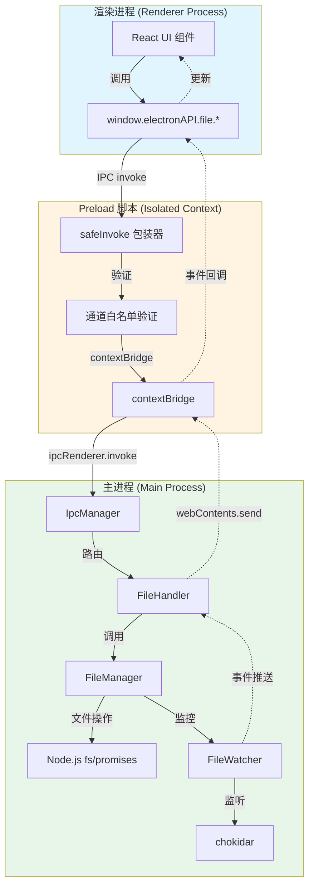
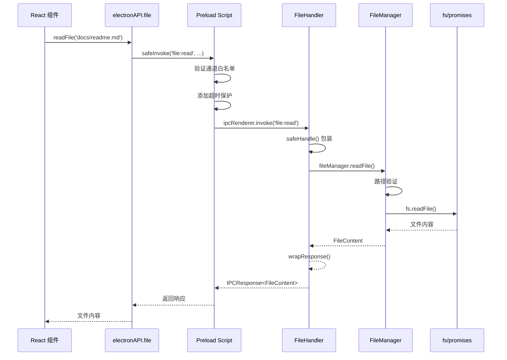
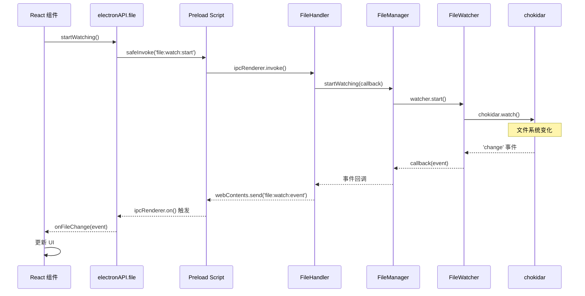
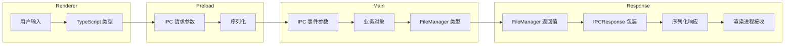
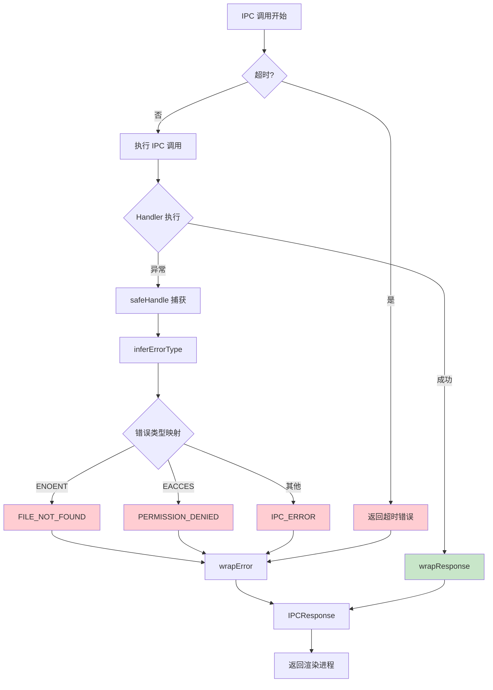
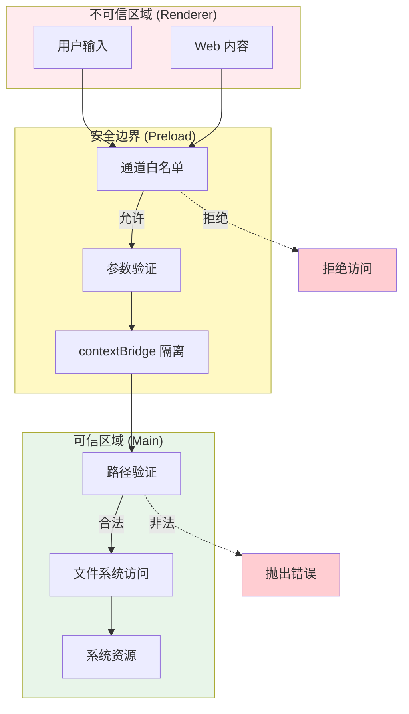
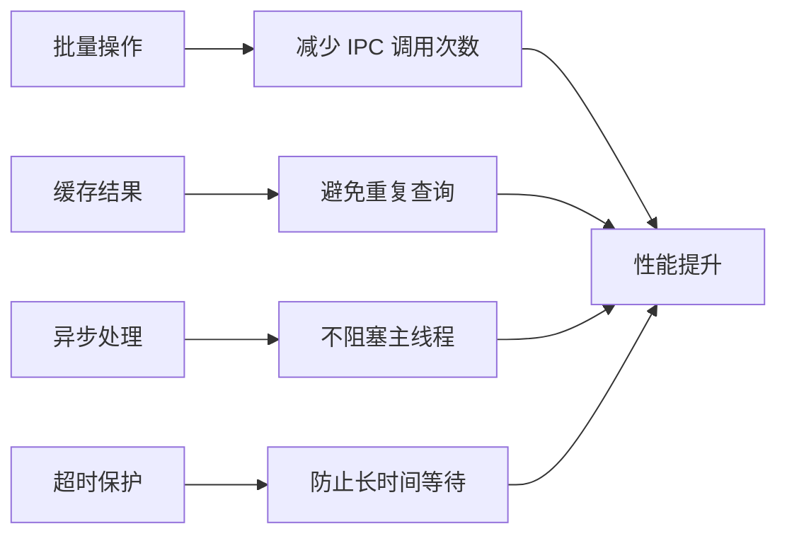
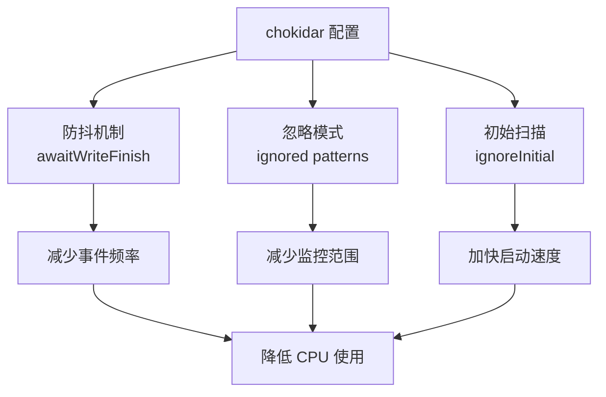
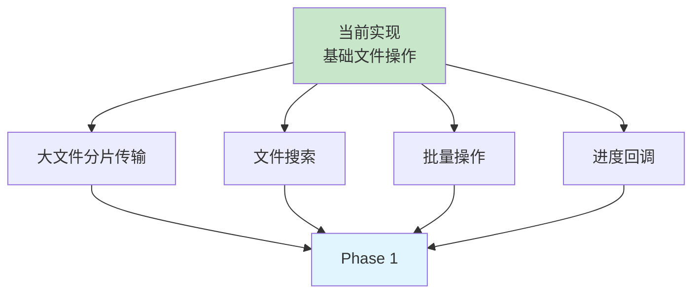

# Phase0-Task008 第5步：IPC 集成架构图

## 整体架构



## IPC 通道流程

### 1. 文件读取流程



### 2. 文件监控流程



## 数据流转换

### 类型转换链



### Date 对象序列化

```typescript
// FileManager 返回
{
  modifiedTime: Date,  // Date 对象
  createdTime: Date
}

// IPC 传输（自动序列化）
{
  modifiedTime: "2026-03-12T11:15:00.000Z",  // ISO 8601 字符串
  createdTime: "2026-03-12T10:00:00.000Z"
}

// 渲染进程接收
{
  modifiedTime: string,  // 需要手动转换为 Date
  createdTime: string
}
```

## 错误处理流程



## 安全边界



## 性能优化点

### 1. IPC 调用优化



### 2. 文件监控优化



## 扩展性设计

### 未来支持的功能



---

**创建时间**: 2026-03-12  
**用途**: 可视化 IPC 集成架构，辅助开发和代码审查
