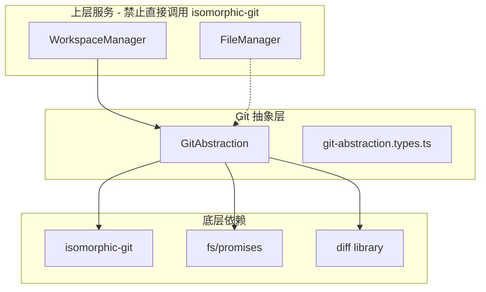

# PHASE0-TASK010: Git 抽象层基础实现 — 实施计划

> 任务来源: [`specs/tasks/phase0/phase0-task010_git-abstraction-basic.md`](../specs/tasks/phase0/phase0-task010_git-abstraction-basic.md)
> 创建日期: 2026-03-14

---

## 一、任务概述

实现 Git 抽象层，封装所有 Git 操作为语义化接口，确保上层代码无需直接调用 isomorphic-git API。这是 CLAUDE.md "Git 不可见"设计哲学的核心技术实现。

### 范围

- Git 仓库初始化
- 文件暂存（add）和提交（commit）
- 状态查询（status）
- 提交历史查询（log）
- 文件差异查询（diff）
- 基础错误处理和日志记录

### 不包含

- 远程同步（push/pull）→ TASK011
- 冲突解决 → Phase 1
- 分支管理 → Phase 1

---

## 二、参考文档索引

### 设计文档

| 文档 | 用途 | 关键章节 |
|------|------|---------|
| [`specs/design/architecture.md`](../specs/design/architecture.md) | 系统架构 | §3.3 Git 抽象层接口 |
| [`specs/design/data-and-api.md`](../specs/design/data-and-api.md) | IPC 接口定义 | §5.2 Git 操作 IPC |
| [`specs/design/testing-and-security.md`](../specs/design/testing-and-security.md) | 测试策略 | §1.1 测试金字塔、§1.2 客户端测试重点 |

### 需求文档

| 文档 | 用途 | 关键章节 |
|------|------|---------|
| [`specs/requirements/phase0/file-system-git-basic.md`](../specs/requirements/phase0/file-system-git-basic.md) | Git 基础需求 | §2.3 Git 仓库初始化、§2.4 Git 基础操作 |

### Skills

| Skill | 用途 |
|-------|------|
| [`.kilocode/skills/phase0/isomorphic-git-integration/SKILL.md`](../.kilocode/skills/phase0/isomorphic-git-integration/SKILL.md) | isomorphic-git API 使用、Git 抽象层设计模式、statusMatrix 解析、diff 实现 |
| [`.kilocode/skills/phase0/typescript-strict-mode/SKILL.md`](../.kilocode/skills/phase0/typescript-strict-mode/SKILL.md) | TypeScript 严格模式、类型守卫、禁止 any 的替代方案 |

### 现有代码参考

| 文件 | 参考点 |
|------|--------|
| [`sibylla-desktop/src/main/services/file-manager.ts`](../sibylla-desktop/src/main/services/file-manager.ts) | 服务类设计模式、错误处理、日志风格 |
| [`sibylla-desktop/src/main/services/workspace-manager.ts`](../sibylla-desktop/src/main/services/workspace-manager.ts) | 依赖注入模式（FileManager 注入）、构造函数风格 |
| [`sibylla-desktop/src/main/services/types/file-manager.types.ts`](../sibylla-desktop/src/main/services/types/file-manager.types.ts) | 类型定义风格（readonly、JSDoc） |
| [`sibylla-desktop/src/shared/types.ts`](../sibylla-desktop/src/shared/types.ts) | IPC_CHANNELS 定义（已预留 git:* 通道） |

---

## 三、架构设计

### 3.1 模块关系



### 3.2 文件结构

```
sibylla-desktop/src/main/services/
├── types/
│   ├── file-manager.types.ts          # 已有
│   ├── workspace.types.ts             # 已有
│   └── git-abstraction.types.ts       # 新增：Git 类型定义
├── file-manager.ts                    # 已有
├── workspace-manager.ts               # 已有
└── git-abstraction.ts                 # 新增：Git 抽象层核心类

sibylla-desktop/tests/services/
└── git-abstraction.test.ts            # 新增：单元测试 + 集成测试
```

### 3.3 关键设计决策

| 决策 | 选择 | 理由 |
|------|------|------|
| diff 库 | `diff` (npm) | 轻量、纯 JS、支持行级 diff |
| fs 模块 | Node.js `fs` (非 promises) | isomorphic-git 要求传入同步 fs 对象 |
| 错误处理 | 自定义 GitAbstractionError | 与 FileManagerError/WorkspaceError 风格一致 |
| 日志 | 复用现有 logger | 保持项目一致性 |

---

## 四、实施步骤

### 步骤 1：安装依赖

安装 isomorphic-git 和 diff 库到 sibylla-desktop。

具体操作：
- `cd sibylla-desktop && npm install isomorphic-git diff`
- `npm install -D @types/diff`（如果有的话）
- 更新 `vite.main.config.ts` 的 `external` 数组，添加 `'isomorphic-git'` 和 `'diff'`

### 步骤 2：创建类型定义文件

创建 `src/main/services/types/git-abstraction.types.ts`，定义：

- `GitAbstractionConfig` — 构造函数配置
- `GitStatus` — 仓库状态（modified/staged/untracked/deleted）
- `CommitInfo` — 提交信息
- `FileDiff` / `DiffHunk` — 差异信息
- `GitAbstractionError` / `GitAbstractionErrorCode` — 错误类型
- `FileStatusType` — 单文件状态枚举

所有接口使用 `readonly` 属性，遵循 TypeScript 严格模式。

### 步骤 3：实现 GitAbstraction 核心类 — 初始化与配置

创建 `src/main/services/git-abstraction.ts`，实现：

- 构造函数（接收 GitAbstractionConfig）
- `init()` — 初始化 Git 仓库、配置用户信息、创建 .gitignore、初始提交
- `isInitialized()` — 检查仓库是否已初始化
- `setConfig()` / `getConfig()` — 更新/读取 Git 配置
- 私有工具方法：`normalizePath()`

关键点：
- isomorphic-git 需要传入 Node.js 的 `fs` 模块（同步版本，非 promises）
- 默认分支名为 `main`
- init 时自动创建 .gitignore（排除 .sibylla/index/、node_modules/ 等）

### 步骤 4：实现文件暂存与提交操作

在 GitAbstraction 类中添加：

- `stageFile(filepath)` — 暂存单个文件
- `stageAll()` — 暂存所有变更
- `unstageFile(filepath)` — 取消暂存（使用 git.resetIndex）
- `commit(message)` — 创建提交，返回 commit hash
- `commitAll(message)` — 暂存所有 + 提交

关键点：
- commit 时自动附加 author/committer 信息和时间戳
- 无暂存文件时 commit 应优雅处理（不抛错或抛明确错误）
- 所有操作有结构化日志

### 步骤 5：实现状态查询

在 GitAbstraction 类中添加：

- `getStatus()` — 返回 GitStatus（modified/staged/untracked/deleted）
- `getFileStatus(filepath)` — 返回单文件状态

关键点：
- 使用 `git.statusMatrix()` 解析状态矩阵
- statusMatrix 返回 `[filepath, HEAD, WORKDIR, STAGE]` 四元组
- 需要正确映射各种状态组合（参考 isomorphic-git-integration skill）
- 过滤 .git/ 目录下的文件

### 步骤 6：实现历史查询

在 GitAbstraction 类中添加：

- `getHistory(options?)` — 查询提交历史，支持 depth 和 filepath 过滤
- `getCommit(oid)` — 获取单个提交详情

关键点：
- 使用 `git.log()` 获取提交列表
- filepath 过滤需要比较相邻提交的 tree 差异（使用 `git.walk()` 或 `TREE()` 辅助函数）
- 格式化 CommitInfo 时注意 timestamp 单位（isomorphic-git 返回秒，需转换）

### 步骤 7：实现差异查询

在 GitAbstraction 类中添加：

- `getFileDiff(filepath, commitA?, commitB?)` — 获取文件差异
- `getCommitDiff(oid)` — 获取某次提交的所有文件差异
- 私有方法：`getFileContent(filepath, ref)` — 读取指定版本的文件内容
- 私有方法：`computeDiffHunks(oldContent, newContent)` — 使用 diff 库计算 hunks

关键点：
- 未指定 commitA 时默认使用 HEAD
- 未指定 commitB 时使用工作区文件
- 使用 `git.readBlob()` 读取历史版本文件内容
- 使用 `diff` 库的 `structuredPatch()` 生成标准 diff hunks

### 步骤 8：实现工具方法

在 GitAbstraction 类中添加：

- `getCurrentBranch()` — 获取当前分支名
- `listFiles()` — 列出仓库中所有跟踪的文件

### 步骤 9：编写单元测试

创建 `tests/services/git-abstraction.test.ts`，覆盖：

1. 仓库初始化测试（正常初始化、重复初始化报错）
2. 文件暂存测试（单文件、全部、取消暂存）
3. 提交测试（正常提交、返回 hash、无暂存文件处理）
4. 状态查询测试（modified/staged/untracked/deleted 分类正确）
5. 历史查询测试（深度限制、文件过滤）
6. 差异查询测试（HEAD vs 工作区、两个 commit 之间）
7. 工具方法测试（getCurrentBranch、listFiles）
8. 错误处理测试（无效路径、未初始化仓库）

测试策略：
- 使用真实的临时目录（`os.tmpdir()`）进行测试
- 每个测试用例创建独立的临时仓库
- 测试后清理临时目录
- 目标覆盖率 ≥ 80%

### 步骤 10：编写集成测试

在同一测试文件中添加集成测试：

1. 完整工作流：init → 创建文件 → stage → commit → getHistory → getFileDiff
2. 多文件操作：修改多个文件 → stageAll → commit → 验证状态
3. 错误恢复：模拟错误场景，验证状态一致性

### 步骤 11：更新构建配置和任务状态

- 更新 `vite.main.config.ts` 确保 isomorphic-git 和 diff 被正确 external
- 更新 `specs/tasks/phase0/task-list.md` 标记 TASK010 完成
- 验证 TypeScript 编译无错误
- 验证 ESLint 检查通过

---

## 五、验收标准对照

| 验收项 | 对应步骤 |
|--------|---------|
| 能够初始化 Git 仓库 | 步骤 3 |
| 能够暂存单个文件和所有文件 | 步骤 4 |
| 能够创建提交并返回 commit hash | 步骤 4 |
| 能够查询仓库状态 | 步骤 5 |
| 能够查询提交历史 | 步骤 6 |
| 能够查询文件差异 | 步骤 7 |
| 所有操作有清晰的错误处理和日志输出 | 步骤 3-8 |
| 上层代码无需直接调用 isomorphic-git API | 架构设计 |
| TypeScript strict mode 无错误 | 步骤 11 |
| 单元测试覆盖率 ≥ 80% | 步骤 9-10 |
| 所有公共方法有 JSDoc 注释 | 步骤 3-8 |

### 性能指标

| 指标 | 目标 | 验证方式 |
|------|------|---------|
| Git init | < 1 秒 | 测试中计时 |
| Git commit | < 2 秒 | 测试中计时 |
| Git status | < 500ms | 测试中计时 |
| Git log（50条）| < 1 秒 | 测试中计时 |

---

## 六、风险与缓解

| 风险 | 缓解措施 |
|------|---------|
| isomorphic-git 的 fs 参数需要同步 fs | 使用 Node.js 内置 `fs` 模块（非 promises 版本） |
| statusMatrix 状态组合复杂 | 参考 skill 中的状态映射表，编写全面的测试用例 |
| diff 算法实现复杂 | 使用成熟的 `diff` npm 包，不自己实现 |
| filepath 过滤历史性能差 | 使用 `git.walk()` + `TREE()` 高效比较，限制默认深度 |

---

## 七、注意事项

1. isomorphic-git 的 `fs` 参数必须是 Node.js 的同步 `fs` 模块，不能用 `fs/promises`
2. 所有公共方法必须有英文 JSDoc 注释（遵循 CLAUDE.md §4 代码注释使用英文）
3. 错误处理遵循项目惯例：自定义 Error 类 + 错误码枚举
4. 日志使用现有的 `logger` 工具，格式为 `[GitAbstraction] 操作描述`
5. 不在此任务中实现 IPC 集成（IPC 通道已预留，将在后续任务中连接）
