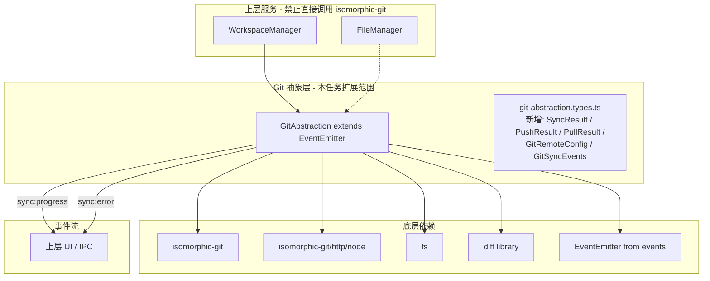
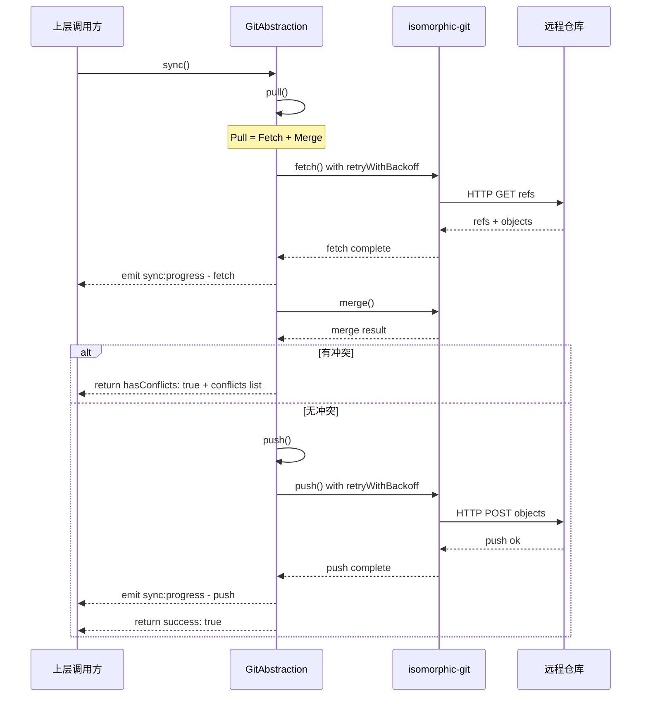
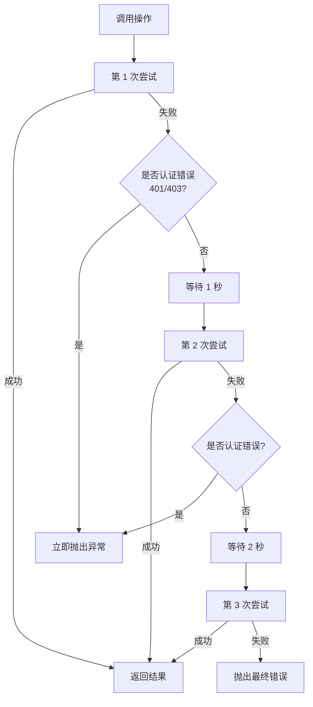

# PHASE0-TASK011: Git 远程同步实现 — 实施计划

> 任务来源: [`specs/tasks/phase0/phase0-task011_git-remote-sync.md`](../specs/tasks/phase0/phase0-task011_git-remote-sync.md)
> 创建日期: 2026-03-27

---

## 一、任务概述

**任务 ID：** PHASE0-TASK011
**任务标题：** Git 远程同步实现
**优先级：** P0
**复杂度：** 复杂
**前置依赖：** ✅ PHASE0-TASK010 - Git 抽象层基础实现（已完成）

### 目标

在 TASK010 已完成的 [`GitAbstraction`](../sibylla-desktop/src/main/services/git-abstraction.ts) 类基础上进行扩展，实现安全、可靠的远程仓库交互能力。核心交付内容包括：

- 远程仓库凭证与 URL 配置管理
- Push 操作（将本地提交推送到远端）及进度反馈
- Pull 操作（Fetch + Merge）及冲突检测
- `sync()` 语义化接口（先 Pull 后 Push 的完整同步流程）
- 指数退避重试机制（网络错误自动重试，认证错误立即失败）
- 通过 `EventEmitter` 发出同步进度事件

### 范围界定

**包含：**
- 凭证与远程信息配置（`setRemote()`）
- 远程推送（`push()`）
- 远程拉取（`pull()` = fetch + merge）
- 统一同步（`sync()` = pull → push）
- 指数退避重试（`retryWithBackoff()`）
- 网络错误和认证错误的分类处理
- 同步进度事件（`sync:progress`、`sync:error`）

**不包含：**
- 冲突解决界面 → Phase 1
- 定时自动同步触发器 → TASK012
- SSH 协议支持（MVP 仅支持 HTTP/HTTPS 基本认证）
- 分支管理（MVP 仅操作主分支 `main`）
- IPC 集成（本任务留下触发点，具体桥接推迟到 TASK012 或后续任务）

---

## 二、参考文档索引

### 设计文档

| 文档 | 调用理由 | 应用场景 |
|------|---------|---------|
| [`specs/design/architecture.md`](../specs/design/architecture.md) | §3.3 定义了 Git 抽象层对上层暴露的语义化接口，包含 `sync()` 的标准签名 | 确保 `sync()` 接口设计与系统架构一致 |
| [`specs/design/data-and-api.md`](../specs/design/data-and-api.md) | §1.2 定义了 `config.json` 中的 `gitRemote` 和 `gitProvider` 字段；§5.2 定义了 Git IPC 通道 | 凭证配置与 IPC 通道命名保持一致 |
| [`specs/design/testing-and-security.md`](../specs/design/testing-and-security.md) | §1.1 测试金字塔、§1.2 客户端测试重点（Git 抽象层：同步、冲突检测）、§3.3 数据安全（Git 传输使用 HTTPS + Token 认证） | 测试策略设计和安全约束遵循 |

### 需求文档

| 文档 | 调用理由 | 应用场景 |
|------|---------|---------|
| [`specs/requirements/phase0/file-system-git-basic.md`](../specs/requirements/phase0/file-system-git-basic.md) | §2.5 定义了 Git 远程同步需求，包含 push/pull 验收标准和重试机制 | 验收标准的权威来源，确保实现符合需求定义 |
| [`specs/requirements/phase0/README.md`](../specs/requirements/phase0/README.md) | 定义了 Phase 0 的里程碑："能够创建 workspace、编辑文件、自动 commit、push 到 Sibylla Git Host、另一台电脑 pull 下来看到变更" | 确认 TASK011 在整体里程碑中的位置 |

### Skills 引用

| Skill | 调用理由 | 应用场景 |
|-------|---------|---------|
| [`.kilocode/skills/phase0/isomorphic-git-integration/SKILL.md`](../.kilocode/skills/phase0/isomorphic-git-integration/SKILL.md) | §4 同步策略提供了 `setRemote()`、`pull()`、`push()`、`sync()` 的参考实现；§5 提供了冲突检测模式；§7 提供了性能优化建议（`singleBranch`、`depth`） | 远程操作 API 设计、fetch/merge 模式、认证方式、浅克隆优化 |
| [`.kilocode/skills/phase0/typescript-strict-mode/SKILL.md`](../.kilocode/skills/phase0/typescript-strict-mode/SKILL.md) | 确保新增类型使用 `readonly` 属性、禁止 `any`、使用类型守卫 | 类型定义风格一致性、错误处理中的类型安全 |

### 现有代码参考

| 文件 | 参考点 |
|------|--------|
| [`sibylla-desktop/src/main/services/git-abstraction.ts`](../sibylla-desktop/src/main/services/git-abstraction.ts) | TASK010 已实现的 `GitAbstraction` 类，本任务在此基础上扩展远程同步方法 |
| [`sibylla-desktop/src/main/services/types/git-abstraction.types.ts`](../sibylla-desktop/src/main/services/types/git-abstraction.types.ts) | 已有的类型定义（`GitAbstractionConfig`、`GitAbstractionError`、`GitAbstractionErrorCode` 等），本任务需追加远程同步相关类型 |
| [`sibylla-desktop/tests/services/git-abstraction.test.ts`](../sibylla-desktop/tests/services/git-abstraction.test.ts) | 60 个单元测试 + 3 个集成测试的编写风格、临时目录策略、辅助函数 |
| [`sibylla-desktop/src/shared/types.ts`](../sibylla-desktop/src/shared/types.ts) | 已预留 `GIT_SYNC: 'git:sync'` IPC 通道，后续任务可直接使用 |
| [`sibylla-desktop/vite.main.config.ts`](../sibylla-desktop/vite.main.config.ts) | 已将 `isomorphic-git`、`diff`、`events` 列入 external 配置 |

---

## 三、架构设计

### 3.1 模块关系



### 3.2 文件结构

本任务不新增文件，仅在现有文件上扩展：

```
sibylla-desktop/src/main/services/
├── types/
│   └── git-abstraction.types.ts       # 扩展：追加远程同步相关类型
├── git-abstraction.ts                 # 扩展：继承 EventEmitter、新增远程方法
└── ...

sibylla-desktop/tests/services/
└── git-abstraction.test.ts            # 扩展：追加远程同步相关测试
```

### 3.3 EventEmitter 继承方案

当前 [`GitAbstraction`](../sibylla-desktop/src/main/services/git-abstraction.ts:62) 是一个普通类。本任务需将其改为继承 `EventEmitter`：

```typescript
import { EventEmitter } from 'events'

export class GitAbstraction extends EventEmitter {
  constructor(config: GitAbstractionConfig) {
    super()  // 必须调用 EventEmitter 构造函数
    // ... 原有构造逻辑不变
  }
}
```

**关键约束：**
- `EventEmitter` 来自 Node.js 内置 `events` 模块，已在 `vite.main.config.ts` 的 external 列表中
- 继承不影响现有方法签名和行为
- 新增的事件类型通过 `GitSyncEvents` 接口定义，提供类型安全的事件监听

### 3.4 凭证管理方案

远程操作需要 URL 和认证 Token。设计如下：

```typescript
// 新增私有属性
private remoteUrl?: string
private authToken?: string

// 认证回调 — 用于 isomorphic-git 的 onAuth 参数
// Gitea/GitHub Token 认证方式：username = token, password = x-oauth-basic
private getAuthCallback(): { username: string; password: string } {
  return {
    username: this.authToken!,
    password: 'x-oauth-basic'
  }
}
```

**设计决策：**

| 决策 | 选择 | 理由 |
|------|------|------|
| 认证方式 | HTTP Token（x-oauth-basic） | Gitea 和 GitHub 均支持，MVP 阶段最简单 |
| Token 存储 | 运行时内存 | 本任务不负责持久化，由上层传入 |
| Remote 名称 | 固定 `origin` | MVP 阶段仅支持单一远程 |
| 默认分支 | 使用已有 `this.defaultBranch`（默认 `main`） | 与 TASK010 保持一致 |

### 3.5 同步流程



### 3.6 重试策略



- 最大重试次数：3 次
- 退避间隔：`2^i * 1000ms`（即 1s → 2s）
- 认证错误（401/403）不重试，立即返回
- 其他网络错误触发重试

---

## 四、实施步骤

### 步骤 1：扩展类型定义

**目标：** 在 [`git-abstraction.types.ts`](../sibylla-desktop/src/main/services/types/git-abstraction.types.ts) 中追加远程同步所需的接口和错误码。

**新增类型定义：**

```typescript
// ─── 远程同步结果类型 ─────────────────────────────

/** Push 操作结果 */
export interface PushResult {
  readonly success: boolean
  readonly error?: string
}

/** Pull 操作结果 */
export interface PullResult {
  readonly success: boolean
  readonly hasConflicts?: boolean
  readonly conflicts?: readonly string[]
  readonly error?: string
}

/** Sync 操作结果（pull + push 的综合结果） */
export interface SyncResult {
  readonly success: boolean
  readonly hasConflicts?: boolean
  readonly conflicts?: readonly string[]
  readonly error?: string
}

/** 远程仓库配置 */
export interface GitRemoteConfig {
  readonly url: string
  readonly token: string
}

// ─── 同步进度事件 ─────────────────────────────────

/** 同步进度数据 */
export interface SyncProgressData {
  readonly phase: 'fetch' | 'push'
  readonly loaded: number
  readonly total: number
}

/** GitAbstraction 事件类型映射 */
export interface GitSyncEvents {
  'sync:progress': [progress: SyncProgressData]
  'sync:error': [error: Error]
}
```

**扩展错误码：**

在 `GitAbstractionErrorCode` 枚举中追加：

```typescript
/** Failed to configure remote repository */
REMOTE_CONFIG_FAILED = 'REMOTE_CONFIG_FAILED',

/** Remote repository is not configured */
REMOTE_NOT_CONFIGURED = 'REMOTE_NOT_CONFIGURED',

/** Push operation failed */
PUSH_FAILED = 'PUSH_FAILED',

/** Pull operation failed */
PULL_FAILED = 'PULL_FAILED',

/** Sync operation failed */
SYNC_FAILED = 'SYNC_FAILED',

/** Authentication failed - 401/403 */
AUTH_FAILED = 'AUTH_FAILED',

/** Network error during remote operation */
NETWORK_ERROR = 'NETWORK_ERROR',
```

**关键约束：**
- 所有接口属性使用 `readonly`
- 禁止使用 `any` 类型
- 遵循现有的 JSDoc 注释风格（英文）

---

### 步骤 2：让 GitAbstraction 继承 EventEmitter

**目标：** 修改 [`git-abstraction.ts`](../sibylla-desktop/src/main/services/git-abstraction.ts:62) 中的 `GitAbstraction` 类声明，使其继承 `EventEmitter`。

**修改内容：**

1. 在文件头部添加 `import { EventEmitter } from 'events'`
2. 修改类声明为 `export class GitAbstraction extends EventEmitter`
3. 在构造函数首行添加 `super()` 调用
4. 添加 `import http from 'isomorphic-git/http/node'`
5. 添加私有属性 `remoteUrl` 和 `authToken`

**关键约束：**
- `super()` 必须在 `this` 访问之前调用
- 不修改任何现有方法的签名或行为
- 确保现有 60 个单元测试和 3 个集成测试不受影响

**验证方式：** 修改后运行 `npm test`，确认所有现有测试通过。

---

### 步骤 3：实现凭证配置方法 setRemote

**目标：** 实现 `setRemote(url: string, token: string): Promise<void>` 方法。

**实现逻辑：**

1. 验证 `url` 和 `token` 非空，否则抛出 `GitAbstractionError`（`REMOTE_CONFIG_FAILED`）
2. 将 `url` 和 `token` 存储到实例属性
3. 调用 `git.addRemote()` 添加 remote `origin`
4. 若 remote 已存在（`addRemote` 报错），捕获异常并尝试使用 `git.deleteRemote()` 后重新 `git.addRemote()`
5. 记录结构化日志

**辅助方法：**

实现私有方法 `requireRemoteConfig(): void`：
- 检查 `remoteUrl` 和 `authToken` 是否已配置
- 未配置时抛出 `GitAbstractionError`（`REMOTE_NOT_CONFIGURED`）

---

### 步骤 4：实现 Push 操作

**目标：** 实现 `push(): Promise<PushResult>` 方法。

**实现逻辑：**

1. 调用 `this.requireRemoteConfig()` 确保远程已配置
2. 调用 `this.ensureInitialized()` 确保仓库已初始化
3. 使用 `retryWithBackoff` 包装 `git.push()` 调用
4. `git.push()` 参数：
   - `fs`、`http`、`dir: this.workspaceDir`
   - `remote: 'origin'`、`ref: this.defaultBranch`
   - `onAuth: () => this.getAuthCallback()`
   - `onProgress: (progress) => this.emit('sync:progress', { phase: 'push', ...progress })`
5. 成功返回 `{ success: true }`
6. 异常时记录日志并返回 `{ success: false, error: error.message }`

---

### 步骤 5：实现 Pull 操作

**目标：** 实现 `pull(): Promise<PullResult>` 方法。

**实现逻辑（Fetch + Merge 两阶段）：**

**阶段一：Fetch**
1. 调用 `this.requireRemoteConfig()` 和 `this.ensureInitialized()`
2. 使用 `retryWithBackoff` 包装 `git.fetch()` 调用
3. `git.fetch()` 参数：
   - `fs`、`http`、`dir: this.workspaceDir`
   - `remote: 'origin'`、`ref: this.defaultBranch`
   - `singleBranch: true`（性能优化）
   - `onAuth` 和 `onProgress` 同 push

**阶段二：Merge**
1. 调用 `git.merge()`：
   - `ours: this.defaultBranch`
   - `theirs: 'origin/' + this.defaultBranch`
   - `author: { name: this.authorName, email: this.authorEmail }`
2. 检查 `result.conflicts`：
   - 有冲突：返回 `{ success: false, hasConflicts: true, conflicts: result.conflicts }`
   - 无冲突：返回 `{ success: true }`

**异常处理：**
- 区分网络错误和认证错误
- Merge 阶段的 `MergeNotSupportedError` 需要特殊处理（`isomorphic-git` 在非 fast-forward 场景下可能抛出此异常）

---

### 步骤 6：实现重试机制和 Sync 方法

**目标：** 实现 `retryWithBackoff()` 私有方法和 `sync()` 公共方法。

**retryWithBackoff 实现：**

```typescript
private async retryWithBackoff<T>(
  operation: () => Promise<T>,
  maxRetries: number = 3
): Promise<T> {
  for (let i = 0; i < maxRetries; i++) {
    try {
      return await operation()
    } catch (error: unknown) {
      const errorMessage = error instanceof Error ? error.message : String(error)
      const isAuthError = errorMessage.includes('401') || errorMessage.includes('403')

      // 认证错误不重试
      if (isAuthError) {
        throw new GitAbstractionError(
          GitAbstractionErrorCode.AUTH_FAILED,
          `Authentication failed: ${errorMessage}`,
          { attempt: i + 1 }
        )
      }

      // 最后一次重试也失败
      if (i === maxRetries - 1) {
        throw new GitAbstractionError(
          GitAbstractionErrorCode.NETWORK_ERROR,
          `Operation failed after ${maxRetries} attempts: ${errorMessage}`,
          { attempts: maxRetries }
        )
      }

      const delay = Math.pow(2, i) * 1000
      logger.debug(`${LOG_PREFIX} Operation failed, retrying in ${delay}ms...`,
        { attempt: i + 1, maxRetries, error: errorMessage })
      await new Promise(resolve => setTimeout(resolve, delay))
    }
  }
  // TypeScript 需要这个 — 实际不会到达
  throw new Error('Max retries exceeded')
}
```

**sync 实现：**

```typescript
async sync(): Promise<SyncResult> {
  logger.info(`${LOG_PREFIX} Starting sync process`)

  // 先 pull 再 push（Git 最佳实践）
  const pullResult = await this.pull()

  // pull 出现冲突 → 中断，交给上层处理
  if (!pullResult.success && pullResult.hasConflicts) {
    return {
      success: false,
      hasConflicts: true,
      conflicts: pullResult.conflicts
    }
  }

  // pull 网络/认证失败
  if (!pullResult.success) {
    return { success: false, error: pullResult.error }
  }

  // pull 成功后执行 push
  const pushResult = await this.push()

  if (!pushResult.success) {
    return { success: false, error: pushResult.error }
  }

  logger.info(`${LOG_PREFIX} Sync completed successfully`)
  return { success: true }
}
```

---

### 步骤 7：编写单元测试和集成测试

**目标：** 在 [`git-abstraction.test.ts`](../sibylla-desktop/tests/services/git-abstraction.test.ts) 中追加远程同步相关测试。

**测试策略：**
- 远程操作通过 Mock `isomorphic-git/http/node` 模块来隔离网络依赖
- 使用 `vi.mock()` 和 `vi.spyOn()` 拦截 `git.push()`、`git.fetch()`、`git.merge()` 调用
- 集成测试使用两个本地仓库（一个作为远端裸仓库）模拟 push/pull 流程

**新增测试用例：**

1. **凭证配置测试组**（3-4 个用例）
   - `setRemote()` 正常配置 URL 和 Token
   - URL 为空时抛出 `REMOTE_CONFIG_FAILED` 错误
   - Token 为空时抛出 `REMOTE_CONFIG_FAILED` 错误
   - Remote 已存在时能正确更新

2. **重试机制测试组**（4 个用例）
   - 第 1 次失败、第 2 次成功 → 返回成功结果
   - 认证错误（含 '401'） → 立即抛出 `AUTH_FAILED`，不重试
   - 认证错误（含 '403'） → 立即抛出 `AUTH_FAILED`，不重试
   - 连续 3 次失败 → 抛出 `NETWORK_ERROR`

3. **Push 测试组**（3-4 个用例）
   - 正常推送成功
   - 远程未配置时抛出 `REMOTE_NOT_CONFIGURED`
   - 推送失败返回错误信息
   - 推送时发出 `sync:progress` 事件

4. **Pull 测试组**（4-5 个用例）
   - 正常拉取成功（无冲突）
   - 拉取检测到冲突 → 返回 `hasConflicts: true` + 冲突文件列表
   - 远程未配置时抛出错误
   - 网络失败返回错误信息
   - 拉取时发出 `sync:progress` 事件

5. **Sync 流程测试组**（4-5 个用例）
   - pull 成功 + push 成功 → `sync()` 返回 `success: true`
   - pull 发现冲突 → `sync()` 返回冲突信息，push 未被调用
   - pull 网络失败 → `sync()` 返回错误，push 未被调用
   - pull 成功 + push 失败 → `sync()` 返回 push 错误

6. **集成测试组**（1-2 个用例，使用本地文件路径模拟远端）
   - 完整的 init → setRemote → 创建文件 → stage → commit → push 流程
   - 基本的 pull → 修改 → commit → push 流程

**覆盖率目标：** 保持整体 ≥ 80%

---

### 步骤 8：更新构建配置和任务状态

**目标：** 确保构建和代码质量检查通过，更新任务跟踪。

**检查项：**

1. 确认 `vite.main.config.ts` 的 external 列表包含 `isomorphic-git/http/node`（如果需要的话 — isomorphic-git 的子模块可能被自动 external 化，但需验证）
2. 运行 `npm run type-check` 确认 TypeScript strict mode 零错误
3. 运行 `npm run lint` 确认 ESLint 零警告
4. 运行 `npm test` 确认所有测试（旧 + 新）全部通过
5. 更新 [`specs/tasks/phase0/task-list.md`](../specs/tasks/phase0/task-list.md) 标记 TASK011 完成

---

## 五、验收标准对照

### 功能完整性

| 验收项 | 对应步骤 | 验证方式 |
|--------|---------|---------|
| 能够成功设置远程仓库 URL 和认证 Token | 步骤 3 | 单元测试：凭证配置测试组 |
| `pull()` 能够从远端拉取并合并代码 | 步骤 5 | 单元测试 + 集成测试 |
| 冲突时 `pull()` 能安全中止并返回冲突文件列表 | 步骤 5 | 单元测试：Mock merge 返回冲突 |
| `push()` 能够将本地提交推送到远端 | 步骤 4 | 单元测试 + 集成测试 |
| `sync()` 能够执行 pull-then-push 工作流 | 步骤 6 | 单元测试：Sync 流程测试组 |
| 网络错误时自动指数退避重试（最多 3 次） | 步骤 6 | 单元测试：重试机制测试组 |
| 401/403 认证错误不重试并立即返回 | 步骤 6 | 单元测试：认证错误测试 |
| 同步过程通过 `EventEmitter` 发出进度事件 | 步骤 2、4、5 | 单元测试：事件监听验证 |

### 性能指标

| 指标 | 目标 | 验证方式 |
|------|------|---------|
| 空 Sync 耗时 | < 1.5 秒（依赖网络） | 集成测试中计时（本地模拟可控） |
| 不阻塞渲染进程 | 异步操作，不阻塞 | 架构保证（主进程异步 + IPC） |
| 内存稳定性 | 无 OOM | 大文件场景暂由 isomorphic-git 内部管理 |

### 用户体验

| 验收项 | 对应步骤 | 验证方式 |
|--------|---------|---------|
| 错误信息区分"网络问题"、"认证失败"和"代码冲突" | 步骤 4、5、6 | 返回值中 `error` 和 `hasConflicts` 字段 |
| 进度事件颗粒度支持前端展示 | 步骤 4、5 | `sync:progress` 事件包含 `phase`/`loaded`/`total` |

### 代码质量

| 验收项 | 对应步骤 | 验证方式 |
|--------|---------|---------|
| TypeScript strict mode 零警告/错误 | 步骤 8 | `npm run type-check` |
| 扩展功能有单元测试和 Mock 测试 | 步骤 7 | `npm test` |
| 保持原 TASK010 单测覆盖率 >80% | 步骤 7、8 | 运行全量测试 + 覆盖率报告 |
| 所有新增公共方法有英文 JSDoc 注释 | 步骤 3-6 | 代码审查 |

---

## 六、风险与缓解

| 风险 | 影响 | 概率 | 缓解措施 |
|------|------|------|---------|
| 网络连接超时不可控 | 中 | 高 | 设定 `retryWithBackoff` 指数退避策略（1s → 2s → 失败），避免长时间阻塞 |
| `isomorphic-git` 的 `merge()` 在复杂场景下可能抛出 `MergeNotSupportedError` | 中 | 中 | 在 `pull()` 中特殊捕获此异常，返回明确错误信息，提示用户需要手动解决 |
| `EventEmitter` 继承可能影响现有测试 | 低 | 低 | 步骤 2 完成后立即运行全量测试验证向后兼容性 |
| 跨平台下 HTTP 代理配置导致 Node fetch 异常 | 低 | 中 | MVP 阶段暂不考虑复杂代理场景，后期通过支持自定义 http agent 解决 |
| Mock `isomorphic-git` 内部行为困难 | 中 | 中 | 使用 `vi.mock()` 在模块级别 Mock，结合 `vi.spyOn()` 实现精确控制；集成测试使用本地裸仓库模拟远端 |
| `isomorphic-git/http/node` 在 Vite 打包时的模块解析问题 | 低 | 中 | 在 `vite.main.config.ts` 的 external 中添加 `isomorphic-git/http/node` |

---

## 七、注意事项

### 7.1 isomorphic-git 远程操作要点

1. **`fs` 参数**：必须使用 Node.js 的同步 `fs` 模块（非 `fs/promises`），与 TASK010 保持一致
2. **`http` 参数**：必须从 `isomorphic-git/http/node` 导入 HTTP 客户端，这是 Node.js 环境专用的适配器
3. **认证方式**：`onAuth` 回调返回 `{ username: token, password: 'x-oauth-basic' }` — 这是 Gitea/GitHub Token 认证的标准方式
4. **`singleBranch`**：fetch 时应设置 `singleBranch: true`，仅拉取当前分支，提升性能
5. **merge 的 `author`**：merge 操作需要提供 author 信息（用于合并提交）

### 7.2 编码规范

1. 所有公共方法必须有英文 JSDoc 注释（遵循 [`CLAUDE.md`](../CLAUDE.md) §4 代码注释使用英文）
2. 错误处理遵循项目惯例：使用 [`GitAbstractionError`](../sibylla-desktop/src/main/services/types/git-abstraction.types.ts:255) 类 + `GitAbstractionErrorCode` 枚举
3. 日志使用现有的 [`logger`](../sibylla-desktop/src/main/utils/logger.ts) 工具，格式为 `[GitAbstraction] 操作描述`
4. 所有异步操作必须有明确的错误处理，禁止静默吞掉异常
5. 禁止使用 `any` 类型，使用 `unknown` + 类型守卫

### 7.3 EventEmitter 继承注意点

1. `super()` 必须在构造函数中所有 `this` 访问之前调用
2. 事件名使用字符串字面量类型，通过 `GitSyncEvents` 接口约束
3. EventEmitter 的事件监听器应在上层（如 IPC Handler、SyncManager）中注册，本类仅负责 `emit`
4. 本任务为 TASK012 的事件桥接留下触发点，但不实现 IPC 层的事件转发

### 7.4 向后兼容性

1. 继承 `EventEmitter` 不应改变任何现有公共方法的签名或行为
2. 新增的私有属性（`remoteUrl`、`authToken`）初始值为 `undefined`，不影响仅使用本地操作的场景
3. 步骤 2 完成后必须立即运行全量测试，确认 60 个单元测试 + 3 个集成测试全部通过

### 7.5 后续任务衔接

1. **TASK012（自动保存）** 将消费本任务提供的 `sync()` 接口，并可能通过 `on('sync:progress')` 监听进度
2. **Phase 1 冲突解决** 将在 `pull()` 返回 `hasConflicts: true` 的基础上，扩展 UI 层的冲突解决界面
3. 本任务的 `setRemote()` 方法为 TASK013（客户端与云端集成测试）提供配置远程仓库的入口

---

**创建时间：** 2026-03-27
**最后更新：** 2026-03-27
