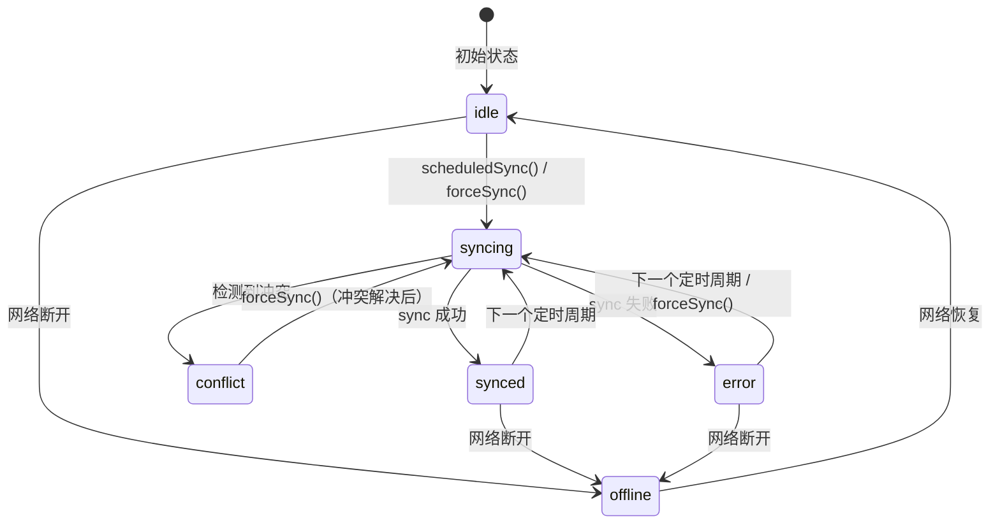

# PHASE0-TASK012: 自动保存机制实现 — 实施计划

> 任务来源：[specs/tasks/phase0/phase0-task012_auto-save.md](../specs/tasks/phase0/phase0-task012_auto-save.md)
> 创建日期：2026-03-28
> 最后更新：2026-03-28

---

## 一、任务概述

| 字段 | 内容 |
|------|------|
| **任务 ID** | PHASE0-TASK012 |
| **任务标题** | 自动保存机制实现 |
| **优先级** | P0 |
| **复杂度** | 中等 |
| **预估工时** | 2-3 工作日 |
| **前置依赖** | ✅ TASK008（文件管理器）、✅ TASK010（Git 抽象层基础）、✅ TASK011（Git 远程同步） |

### 目标

实现 `SyncManager` 类，作为自动保存与同步的调度核心。它将 FileManager 的文件变更事件、GitAbstraction 的提交与同步能力、以及 Electron 的网络状态检测整合为一条自动化流水线：

1. 文件变更后 **防抖 1 秒**，自动执行 `stageFile` + `commit`
2. 每隔 **30 秒**（可配置），自动执行 `sync()`（pull → push）
3. 通过 **IPC 事件推送**，让前端感知同步状态（synced / syncing / conflict / error）
4. 监测 **网络在线/离线状态**，离线时暂停同步，上线后自动恢复

### 范围界定

**包含：**
- `SyncManager` 类设计与实现（EventEmitter，防抖提交，定时同步，网络监测）
- `SyncHandler` IPC 处理器（同步状态推送，手动强制同步接口）
- IPC 通道扩展（`sync:force`、`sync-status-changed`）
- Preload API 扩展（sync 命名空间）
- 主进程集成（在 `index.ts` 中初始化 SyncManager 并关联 FileManager 与 GitAbstraction）
- 完整单元测试与集成测试

**不包含（延至 Phase 1）：**
- 冲突解决 UI 界面
- 手动触发同步 UI 按钮组件
- 前端状态栏 React 组件实现（仅暴露 IPC 接口，不实现 UI 组件）

---

## 二、参考文档索引

### 设计文档

| 文档 | 调用理由 | 应用场景 |
|------|---------|---------|
| [architecture.md](../specs/design/architecture.md) | 数据流概览（§1.3）定义了防抖 1 秒 + 30 秒 auto push 的完整流程 | 确认 SyncManager 在架构中的定位（§3.1 SyncManager 模块） |
| [data-and-api.md](../specs/design/data-and-api.md) | IPC 通信接口规范（§5）定义了 `ipc:git:sync` 等通道 | 确认 IPC 通道命名规范和 `sync-status-changed` 事件格式 |
| [ui-ux-design.md](../specs/design/ui-ux-design.md) | 底栏同步状态指示器定义（§2.1 布局，底栏"已同步 ✓"） | 确认前端需要什么同步状态数据 |
| [testing-and-security.md](../specs/design/testing-and-security.md) | 测试金字塔与覆盖率目标（§1.1 单元测试 ≥80%） | 测试策略和覆盖率标准 |

### 需求文档

| 文档 | 调用理由 | 应用场景 |
|------|---------|---------|
| [file-system-git-basic.md](../specs/requirements/phase0/file-system-git-basic.md) | 需求 2.4 Git 基础操作 + 需求 2.5 Git 远程同步 | 确认 stageFile/commit/sync 的验收标准和性能指标 |
| [infrastructure-setup.md](../specs/requirements/phase0/infrastructure-setup.md) | IPC 通信框架规范（需求 2.2） | 确认 IPC Handler 注册模式和错误处理规范 |

### Skill 文件

| Skill | 调用理由 | 应用场景 |
|-------|---------|---------|
| [electron-ipc-patterns](../.kilocode/skills/phase0/electron-ipc-patterns/SKILL.md) | IPC 双向通信最佳实践 | SyncHandler 实现、主进程向渲染进程广播同步状态事件 |
| [electron-desktop-app](../.kilocode/skills/phase0/electron-desktop-app/SKILL.md) | Electron 主进程服务架构 | SyncManager 生命周期管理、`net` 模块网络状态检测 |
| [typescript-strict-mode](../.kilocode/skills/phase0/typescript-strict-mode/SKILL.md) | TypeScript 严格模式类型设计 | SyncManager 类型定义、事件类型安全 |
| [isomorphic-git-integration](../.kilocode/skills/phase0/isomorphic-git-integration/SKILL.md) | Git 自动提交策略 | autoCommitFile 逻辑与 hasStagedChanges 检查 |

### 已完成的依赖代码

| 源码文件 | 来自任务 | 复用方式 |
|---------|---------|---------|
| `src/main/services/file-manager.ts` | TASK008 | 调用 `exists()` 检查文件；通过 `startWatching()` 回调接收 `FileWatchEvent` |
| `src/main/services/file-watcher.ts` | TASK008 | FileWatcher 提供 `add`/`change`/`unlink` 等事件类型 |
| `src/main/services/types/file-manager.types.ts` | TASK008 | 复用 `FileWatchEvent`、`FileWatchEventType` 类型 |
| `src/main/services/git-abstraction.ts` | TASK010+011 | 调用 `stageFile()`、`commit()`、`sync()`；监听 `sync:progress`/`sync:error` 事件 |
| `src/main/services/types/git-abstraction.types.ts` | TASK010+011 | 复用 `SyncResult`、`SyncProgressData`、`GitSyncEvents`、`GitAbstractionErrorCode` 类型 |
| `src/main/utils/retry.ts` | TASK011 | 可选：SyncManager 内部重试可复用 `retryWithBackoff` |
| `src/main/utils/logger.ts` | TASK001 | 结构化日志输出 |
| `src/main/ipc/handler.ts` | TASK002 | IpcHandler 基类，`safeHandle()` 包装 |
| `src/main/ipc/index.ts` | TASK002 | IpcManager 单例注册 |
| `src/shared/types.ts` | TASK001+002 | `IPC_CHANNELS`、`IPCResponse`、`ErrorType`、`WorkspaceConfig.syncInterval` |
| `src/main/index.ts` | TASK001 | 主进程入口，服务初始化和 handler 注册位置 |

---

## 三、架构设计

### 3.1 模块关系

```mermaid
graph TB
    subgraph 渲染进程
        UI[前端 UI - 同步状态指示器]
    end

    subgraph Preload
        PreloadSync[sync API - force/onStatusChange]
    end

    subgraph 主进程
        FW[FileWatcher<br/>文件变更事件]
        FM[FileManager<br/>文件操作]
        SM[SyncManager<br/>调度核心]
        GA[GitAbstraction<br/>Git 操作]
        SH[SyncHandler<br/>IPC 处理器]
        NET[Electron net<br/>网络状态]
    end

    FW -->|FileWatchEvent| SM
    SM -->|exists()| FM
    SM -->|stageFile/commit/sync| GA
    SM -->|sync:start/success/error/conflict| SH
    NET -->|online/offline| SM
    SH -->|sync-status-changed| PreloadSync
    PreloadSync -->|事件| UI
    UI -->|ipc:sync:force| SH
    SH -->|forceSync()| SM
```

### 3.2 文件结构

本任务需要新建以下文件：

```
src/main/services/
  sync-manager.ts              # NEW - SyncManager 核心类
  types/
    sync-manager.types.ts      # NEW - SyncManager 类型定义

src/main/ipc/handlers/
  sync.handler.ts              # NEW - SyncHandler IPC 处理器

tests/services/
  sync-manager.test.ts         # NEW - SyncManager 单元测试
  sync-manager-integration.test.ts  # NEW - 集成测试
```

需要修改的文件：

```
src/shared/types.ts            # MODIFY - 新增 IPC 通道常量
src/preload/index.ts           # MODIFY - 新增 sync API
src/main/index.ts              # MODIFY - 初始化 SyncManager 并注册 SyncHandler
```

### 3.3 SyncManager 类设计

```typescript
export class SyncManager extends EventEmitter {
  // 依赖注入
  private readonly fileManager: FileManager
  private readonly gitAbstraction: GitAbstraction

  // 配置
  private readonly saveDebounceMs: number   // 默认 1000
  private readonly syncIntervalMs: number   // 默认 30000

  // 防抖定时器（per-file）
  private readonly saveTimeouts: Map<string, NodeJS.Timeout>

  // 同步定时器
  private syncTimer: NodeJS.Timeout | null

  // 状态
  private isOnline: boolean
  private isSyncing: boolean
  private isStarted: boolean

  // 事件：sync:start, sync:success, sync:conflict, sync:error, sync:end, status:changed
}
```

#### 设计决策

| 决策项 | 选择 | 理由 |
|--------|------|------|
| SyncManager 继承 EventEmitter | 是 | 与 GitAbstraction 保持一致模式；解耦 SyncHandler |
| FileWatcher 集成方式 | 外部传入回调而非 SyncManager 直接创建 FileWatcher | 遵循任务 spec 备注"修改 FileWatcher 模块通过事件派发变更消息给 SyncManager"，解耦最优 |
| 网络检测方式 | `electron.net.isOnline()` + `powerMonitor` 事件 | 比 `navigator.onLine` 更可靠；powerMonitor 处理休眠/唤醒场景 |
| commit 无变更处理 | 捕获 `NOTHING_TO_COMMIT` 错误并静默忽略 | GitAbstraction.commit() 在无暂存变更时抛此错误，属于正常场景 |
| 同步锁机制 | `isSyncing` 布尔标志 | 简单有效，防止并发 sync 调用 |

### 3.4 状态转换



### 3.5 IPC 通道设计

```typescript
// 新增 IPC 通道
SYNC_FORCE: 'sync:force'               // 渲染 → 主：手动触发同步
SYNC_STATUS_CHANGED: 'sync:status-changed'  // 主 → 渲染：状态推送

// SyncStatus 数据结构
interface SyncStatusData {
  status: 'idle' | 'syncing' | 'synced' | 'conflict' | 'error' | 'offline'
  timestamp: number
  message?: string           // error 时的错误信息
  conflictFiles?: string[]   // conflict 时的冲突文件列表
}
```

---

## 四、实施步骤

### 步骤 1：类型定义

**目标：** 创建 `sync-manager.types.ts`，定义 SyncManager 所需的所有类型。

**产出文件：** `src/main/services/types/sync-manager.types.ts`

**输入依赖：**
- `src/main/services/types/git-abstraction.types.ts`（复用 `SyncResult`）
- `src/shared/types.ts`（复用 `WorkspaceConfig.syncInterval`）

**实现内容：**
```typescript
// SyncManagerConfig - 构造函数配置
export interface SyncManagerConfig {
  readonly workspaceDir: string
  readonly saveDebounceMs?: number   // 默认 1000
  readonly syncIntervalMs?: number   // 默认 30000
}

// SyncStatus - 同步状态枚举
export type SyncStatus = 'idle' | 'syncing' | 'synced' | 'conflict' | 'error' | 'offline'

// SyncStatusData - 推送给前端的状态数据
export interface SyncStatusData {
  readonly status: SyncStatus
  readonly timestamp: number
  readonly message?: string
  readonly conflictFiles?: readonly string[]
}

// SyncManagerEvents - 事件类型映射
export interface SyncManagerEvents {
  'sync:start': []
  'sync:success': []
  'sync:conflict': [conflicts: readonly string[]]
  'sync:error': [error: Error]
  'sync:end': []
  'status:changed': [data: SyncStatusData]
}
```

**验收条件：**
- 类型文件编译通过，无 TypeScript 错误
- 所有类型使用 `readonly` 修饰符
- 所有类型有 JSDoc 注释

---

### 步骤 2：扩展 IPC 通道定义

**目标：** 在 `IPC_CHANNELS` 中新增同步相关通道，在 preload 白名单中注册。

**产出文件：** `src/shared/types.ts`（修改）

**实现内容：**
- 在 `IPC_CHANNELS` 中新增：
  ```typescript
  // Sync operations
  SYNC_FORCE: 'sync:force',
  SYNC_STATUS_CHANGED: 'sync:status-changed',
  ```
- 确保通道命名与已有 `GIT_SYNC: 'git:sync'` 不冲突（`git:sync` 是直接的 Git 同步操作，`sync:force` 是 SyncManager 层面的强制触发）

**关键约束：**
- 遵循已有通道命名模式（`namespace:action`）
- 注释说明新通道的方向（渲染→主 / 主→渲染）

**验收条件：**
- TypeScript 编译通过
- 新通道不与已有通道冲突

---

### 步骤 3：SyncManager 核心类 — 骨架与生命周期

**目标：** 创建 `SyncManager` 类骨架，实现构造函数、`start()`、`stop()` 生命周期方法和网络状态监听。

**产出文件：** `src/main/services/sync-manager.ts`

**输入依赖：**
- `SyncManagerConfig`、`SyncManagerEvents`（步骤 1）
- `FileManager`（TASK008）
- `GitAbstraction`（TASK010+011）
- `logger`（utils）

**实现要点：**

1. **构造函数**：
   - 接收 `SyncManagerConfig`、`FileManager`、`GitAbstraction`
   - 设置默认值（saveDebounceMs=1000, syncIntervalMs=30000）
   - 初始化 `saveTimeouts` Map、状态标志

2. **start()**：
   - 防重复启动（检查 `isStarted`）
   - 调用 `setupNetworkListeners()` 注册 Electron `net` 模块和 `powerMonitor` 事件
   - 启动 `setInterval` 定时同步调度
   - 记录结构化日志

3. **stop()**：
   - 清除同步定时器 `syncTimer`
   - 清除所有防抖定时器 `saveTimeouts`
   - 移除网络监听器
   - 设置 `isStarted = false`

4. **setupNetworkListeners()**：
   - 使用 `electron.net.isOnline()` 初始检测
   - 注意：在非 Electron 环境（测试）中需要 graceful fallback

**关键约束：**
- `start()` 和 `stop()` 必须幂等
- 所有定时器引用必须可靠清理，防止内存泄漏
- 网络状态检测在测试环境中可被 mock

**验证方式：**
- 构造函数正确设置默认值
- `start()` → `stop()` → `start()` 不报错
- `stop()` 后所有定时器被清除

---

### 步骤 4：防抖与自动提交

**目标：** 实现 `notifyFileChanged()` 防抖逻辑和 `autoCommitFile()` 自动提交逻辑。

**产出文件：** `src/main/services/sync-manager.ts`（继续）

**实现要点：**

1. **notifyFileChanged(filepath: string)**：
   - 如果 `saveTimeouts` 中已有该文件的定时器，先 `clearTimeout`
   - 设置新的 `setTimeout`，延迟 `saveDebounceMs` 后调用 `autoCommitFile(filepath)`
   - 从 Map 中 `delete` 已触发的定时器

2. **autoCommitFile(filepath: string)**：
   - 通过 `fileManager.exists(filepath)` 检查文件是否存在
   - 调用 `gitAbstraction.stageFile(filepath)`
   - 调用 `gitAbstraction.commit(`Auto-save: ${filepath}`)`
   - 捕获 `NOTHING_TO_COMMIT` 错误并静默处理（文件可能未实际变更）
   - 其他错误记录日志并 emit `sync:error`

3. **边界处理：**
   - 文件被删除时（`unlink` 事件）：`stageFile` 内部会调用 `git.remove()`，行为正确
   - 目录事件（`addDir`/`unlinkDir`）：忽略，不触发自动提交
   - `.sibylla/` 目录下的文件变更：应排除（属于系统文件）

**关键约束：**
- 防抖是 per-file 的，不同文件的防抖互不干扰
- `autoCommitFile` 中的 `gitAbstraction` 调用可能失败（如 repo 未初始化），需要妥善处理

**验证方式：**
- 连续调用 `notifyFileChanged('a.md')` 5 次，只有最后一次触发 `commit`
- 调用 `notifyFileChanged('a.md')` 和 `notifyFileChanged('b.md')` 各一次，两者独立触发

---

### 步骤 5：定时同步调度与锁机制

**目标：** 实现 `scheduledSync()` 定时同步逻辑和 `forceSync()` 手动同步入口。

**产出文件：** `src/main/services/sync-manager.ts`（继续）

**实现要点：**

1. **scheduledSync()**：
   - 前置检查：`!isOnline` → 跳过；`isSyncing` → 跳过（防并发）
   - 设置 `isSyncing = true`，emit `sync:start`
   - 调用 `gitAbstraction.sync()`
   - 根据 `SyncResult` 分发事件：
     - `success` → emit `sync:success`，推送 `status:changed { status: 'synced' }`
     - `hasConflicts` → emit `sync:conflict`，推送 `status:changed { status: 'conflict' }`
     - 其他失败 → emit `sync:error`，推送 `status:changed { status: 'error' }`
   - `finally` 块中：`isSyncing = false`，emit `sync:end`

2. **forceSync()**：
   - 返回 `Promise<SyncResult>`
   - 如果 `isSyncing`，等待当前同步完成后再触发（或直接拒绝）
   - 不受 `isOnline` 限制（用户明确触发时应尝试）
   - 调用 `scheduledSync()` 内部逻辑（提取为共享方法 `performSync()`）

3. **状态推送统一入口 `updateStatus()`**：
   - 内部 helper 方法，封装 `emit('status:changed', data)`
   - 自动附加 `timestamp: Date.now()`

**关键约束：**
- `isSyncing` 锁在 `finally` 中释放，确保异常时不会永久锁住
- `sync:start` 和 `sync:end` 成对出现
- 定时器回调中的异常不应导致定时器停止

**验证方式：**
- 定时器到达时，如果 `isSyncing=true`，不会重复调用 `sync()`
- 网络离线时不调用 `sync()`
- `forceSync()` 返回 `SyncResult`

---

### 步骤 6：SyncHandler IPC 处理器

**目标：** 创建 `SyncHandler`，将 SyncManager 事件桥接到 IPC 通道，并处理 `sync:force` 请求。

**产出文件：** `src/main/ipc/handlers/sync.handler.ts`

**输入依赖：**
- `IpcHandler` 基类（TASK002）
- `SyncManager`（步骤 3-5）
- `IPC_CHANNELS`（步骤 2）
- `BrowserWindow`（Electron）

**实现要点：**

1. **类结构**：
   ```typescript
   export class SyncHandler extends IpcHandler {
     readonly namespace = 'sync'
     private syncManager: SyncManager | null = null

     setSyncManager(sm: SyncManager): void
     register(): void
     cleanup(): void
   }
   ```

2. **register()**：
   - 注册 `ipcMain.handle(IPC_CHANNELS.SYNC_FORCE, ...)` → 调用 `syncManager.forceSync()`
   - 监听 SyncManager 的 `status:changed` 事件 → 广播到所有 BrowserWindow

3. **广播逻辑**：
   - 使用 `BrowserWindow.getAllWindows()` 获取所有窗口
   - 遍历 `window.webContents.send(IPC_CHANNELS.SYNC_STATUS_CHANGED, data)`
   - 检查 `webContents.isDestroyed()` 防止向已销毁窗口发送

4. **cleanup()**：
   - 移除 SyncManager 上的事件监听器

**关键约束：**
- 遵循 `file.handler.ts` 中的广播模式（检查 `webContents.isDestroyed()`）
- 使用 `safeHandle()` 包装 IPC handler
- SyncManager 注入采用 setter 模式（与 WorkspaceHandler 一致）

**验证方式：**
- `sync:force` 调用返回 `IPCResponse<SyncResult>`
- SyncManager 状态变更时所有窗口收到 `sync:status-changed` 事件

---

### 步骤 7：Preload API 扩展与主进程集成

**目标：** 扩展 Preload 脚本暴露 sync API；修改主进程 `index.ts` 完成 SyncManager 初始化和生命周期集成。

**产出文件：**
- `src/preload/index.ts`（修改）
- `src/main/index.ts`（修改）

**实现要点：**

1. **Preload 扩展**：
   ```typescript
   sync: {
     force: () => safeInvoke(IPC_CHANNELS.SYNC_FORCE),
     onStatusChange: (callback: (data: SyncStatusData) => void) => {
       // 监听 SYNC_STATUS_CHANGED 事件
       // 返回 unsubscribe 函数
     }
   }
   ```
   - 将 `SYNC_STATUS_CHANGED` 加入 `ALLOWED_CHANNELS`

2. **主进程集成**：
   - 在 workspace 打开时创建 `GitAbstraction` 实例并初始化
   - 创建 `SyncManager` 实例，传入 `FileManager`、`GitAbstraction` 和配置
   - 创建 `SyncHandler` 并注册到 `ipcManager`
   - 调用 `fileManager.startWatching()` 并将回调连接到 `syncManager.notifyFileChanged()`
   - 在 workspace 关闭或 app 退出时调用 `syncManager.stop()`

3. **FileWatcher → SyncManager 连接**：
   ```typescript
   fileManager.startWatching((event) => {
     // 只处理文件变更事件，忽略目录事件
     if (event.type === 'add' || event.type === 'change' || event.type === 'unlink') {
       // 排除 .sibylla/ 系统文件
       if (!event.path.startsWith('.sibylla/')) {
         syncManager.notifyFileChanged(event.path)
       }
     }
   })
   ```

**关键约束：**
- SyncManager 的生命周期必须与 workspace 生命周期绑定
- app 退出时（`will-quit`）必须调用 `syncManager.stop()` 清理资源
- Preload 白名单必须包含新通道

**验证方式：**
- 应用构建成功（`npm run build`）
- TypeScript 编译无错误

---

### 步骤 8：单元测试

**目标：** 编写 SyncManager 单元测试，覆盖所有核心逻辑。使用 Vitest Fake Timers mock 定时器。

**产出文件：** `tests/services/sync-manager.test.ts`

**测试分组与用例：**

1. **构造函数测试**（3 个）：
   - 默认配置值正确
   - 自定义配置值生效
   - 依赖注入正确

2. **生命周期测试**（4 个）：
   - `start()` 启动定时器
   - `start()` 重复调用幂等
   - `stop()` 清除所有定时器
   - `stop()` 重复调用幂等

3. **防抖逻辑测试**（5 个）：
   - 单次调用 `notifyFileChanged` 在 1 秒后触发 `commit`
   - 连续多次调用只触发最后一次
   - 不同文件的防抖互不干扰
   - 文件不存在时不调用 `commit`
   - `NOTHING_TO_COMMIT` 错误被静默处理

4. **自动同步调度测试**（5 个）：
   - 定时器到达时调用 `sync()`
   - `isSyncing=true` 时跳过同步
   - `isOnline=false` 时跳过同步
   - sync 成功 emit `sync:success` 和 `status:changed`
   - sync 冲突 emit `sync:conflict` 和 `status:changed`

5. **forceSync 测试**（3 个）：
   - 正常调用返回 `SyncResult`
   - 忽略网络状态强制执行
   - sync 过程中的 forceSync 行为

6. **网络状态测试**（3 个）：
   - 初始网络状态检测
   - 网络断开时状态变为 offline
   - 网络恢复时恢复同步

7. **事件发射测试**（3 个）：
   - `sync:start` 和 `sync:end` 成对出现
   - 错误事件包含正确的 Error 对象
   - `status:changed` 事件包含正确的 `SyncStatusData`

**测试技术：**
- `vi.useFakeTimers()` / `vi.advanceTimersByTime()` mock 定时器
- `vi.fn()` mock `FileManager` 和 `GitAbstraction` 方法
- `vi.spyOn()` 监听事件 emit

**目标覆盖率：** ≥ 85%

**验收条件：**
- 所有 26 个测试用例通过
- 无内存泄漏（所有定时器正确清理）

---

### 步骤 9：集成测试

**目标：** 整合 FileManager + GitAbstraction + SyncManager，在真实临时目录中验证完整工作流。

**产出文件：** `tests/services/sync-manager-integration.test.ts`

**测试用例：**

1. **完整自动保存流程**：
   - 初始化临时 workspace（FileManager + GitAbstraction + SyncManager）
   - 通过 FileManager 写入文件
   - 推进 Fake Timers 1 秒
   - 验证 Git 仓库中生成了对应 commit

2. **多文件并发保存**：
   - 连续写入 3 个不同文件
   - 推进 Fake Timers
   - 验证 3 个 commit 都生成

3. **生命周期管理**：
   - 启动 SyncManager → 写入文件 → 停止 SyncManager
   - 验证停止后不再触发 commit

**测试技术：**
- 真实 FileManager + GitAbstraction（不 mock）
- 临时目录 + afterEach 清理
- Fake Timers 控制时间推进
- 不测试远程同步（无 Gitea 服务），只测试本地 commit 流程

**验收条件：**
- 所有 3 个集成测试通过
- 测试间无状态泄漏

---

### 步骤 10：构建验证与任务收尾

**目标：** 确保所有代码编译通过，测试全部通过，更新任务状态。

**验证清单：**

1. TypeScript 编译无错误（`npx tsc --noEmit`）
2. 所有单元测试通过（`npx vitest run tests/services/sync-manager.test.ts`）
3. 所有集成测试通过（`npx vitest run tests/services/sync-manager-integration.test.ts`）
4. Vite 构建无错误（`npm run build`，确认 vite.main.config.ts 无需额外 external）
5. 更新 `specs/tasks/phase0/task-list.md` 任务状态

---

## 五、验收标准对照

### 功能完整性

| 验收项 | 对应步骤 | 验证方式 |
|--------|---------|---------|
| 文件变更后 1 秒触发 stageFile + commit | 步骤 4 | 单元测试：Fake Timers 推进 1 秒后断言 commit 调用 |
| 1 秒内再次编辑则延迟重置 | 步骤 4 | 单元测试：连续调用 notifyFileChanged 只触发一次 |
| 每 30 秒执行 sync() | 步骤 5 | 单元测试：Fake Timers 推进 30 秒后断言 sync 调用 |
| 仅在线时执行自动 sync | 步骤 5 | 单元测试：mock isOnline=false 时断言未调用 sync |
| IPC 推送同步状态（synced/syncing/conflict/error） | 步骤 6 | 单元测试：断言 SyncHandler 广播正确数据 |
| stop() 清理所有定时器 | 步骤 3 | 单元测试：stop() 后断言无定时器残留 |

### 性能指标

| 指标 | 对应步骤 | 验证方式 |
|------|---------|---------|
| 防抖和定时器不造成 CPU 异常 | 步骤 4-5 | 代码审查：使用 setTimeout/setInterval，无忙等待 |
| 高频保存不产生内存泄漏 | 步骤 4 | 单元测试：saveTimeouts Map 在定时器触发后清理 |
| isSyncing 锁防止并发 sync | 步骤 5 | 单元测试：isSyncing=true 时跳过 |

### 代码质量

| 指标 | 对应步骤 | 验证方式 |
|------|---------|---------|
| 清晰的事件发送和生命周期控制 | 步骤 3-5 | 代码审查 |
| 所有公共方法有 JSDoc | 全部步骤 | TypeScript 编译检查 |
| 单元测试通过，覆盖率 ≥ 85% | 步骤 8-9 | Vitest 报告 |

---

## 六、风险与缓解

| 风险 | 影响 | 概率 | 缓解措施 |
|------|------|------|---------|
| 并发 commit 导致 Git 锁冲突 | 高 | 中 | `isSyncing` 锁防止 `sync()` 和 `autoCommitFile()` 并发；`autoCommitFile` 内部 try-catch 处理锁异常 |
| Electron `net` 模块在测试环境不可用 | 中 | 高 | 网络检测模块设计为可注入/可 mock；测试中默认 `isOnline=true` |
| 高频文件变更导致 saveTimeouts Map 膨胀 | 低 | 低 | 定时器触发后立即从 Map 中删除；stop() 清空所有定时器 |
| commit 消息格式不可定制 | 低 | 低 | 预留 `commitMessageTemplate` 配置项接口，MVP 使用 `Auto-save: ${filepath}` |
| Fake Timers 在集成测试中与真实 I/O 冲突 | 中 | 中 | 集成测试中仅对定时器逻辑使用 Fake Timers，I/O 操作使用真实计时 |

---

## 七、注意事项

### 7.1 autoCommitFile 与 sync 的并发安全

`autoCommitFile()` 与 `scheduledSync()` 可能在时间窗口上重叠（防抖 1 秒 commit + 30 秒 sync）。需要注意：
- `autoCommitFile` 完成后再进行 `sync` 不会有问题，因为 `sync` 会先 pull 再 push
- 如果 `autoCommitFile` 正在执行时 `scheduledSync` 被触发，`isSyncing` 锁不会阻止 commit（commit 是本地操作），但 `sync` 可能会在 commit 完成前执行，导致最新的 commit 在下一个 sync 周期才被推送——这是可接受的行为

### 7.2 FileWatchEvent 过滤

SyncManager 应只关注 `add`、`change`、`unlink` 三种事件类型。目录事件（`addDir`/`unlinkDir`）不应触发 auto-commit。此外，以下路径应被排除：
- `.sibylla/` 下的系统文件
- `.gitignore` 中的文件（但 FileWatcher 配置中可能已经排除了 `CORE_FORBIDDEN_PATHS`）

### 7.3 编码规范

- 代码注释使用英文（遵循 CLAUDE.md §四通用规范）
- 日志使用 `logger` 工具（结构化日志）
- 错误处理不得静默吞掉异常（但 `NOTHING_TO_COMMIT` 是已知正常场景，可以 debug 级别记录）

### 7.4 Git 未初始化场景

SyncManager 不应在 Git 未初始化时工作。需要在 `autoCommitFile` 和 `performSync` 中检查 `gitAbstraction.isInitialized()` 或依赖 `GitAbstractionError` 的错误码进行防御。

### 7.5 下游任务衔接

本任务完成后为 TASK013（客户端与云端集成测试）提供：
- `SyncManager` 的完整 API 和事件系统
- `SyncHandler` IPC 接口
- Preload `sync` API（`force()` + `onStatusChange()`）
- 同步状态推送通道（`sync:status-changed`）

Phase 1 可基于 `status:changed` 事件和 Preload API 直接实现前端同步状态栏 UI。

---

> 创建日期：2026-03-28
> 最后更新：2026-03-28
