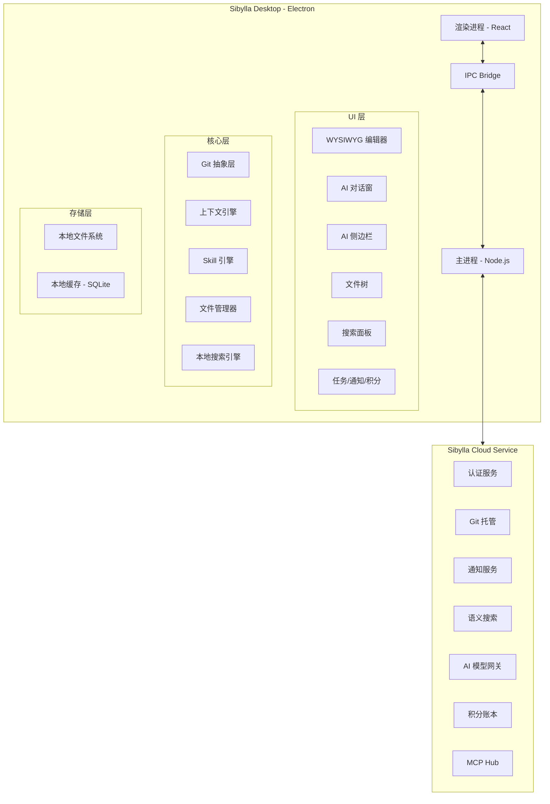
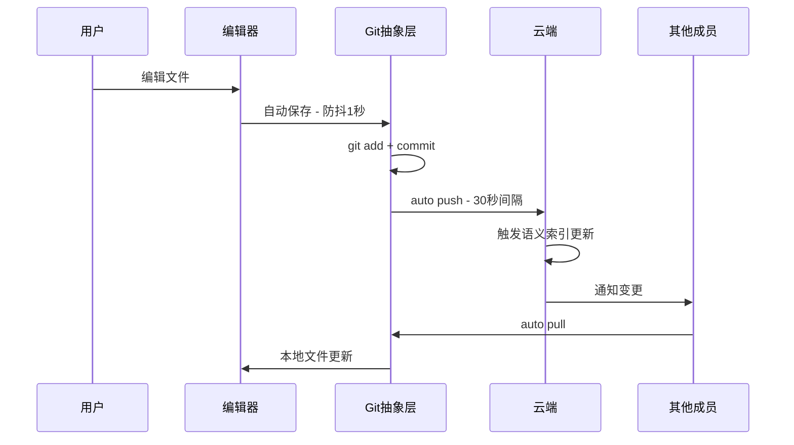
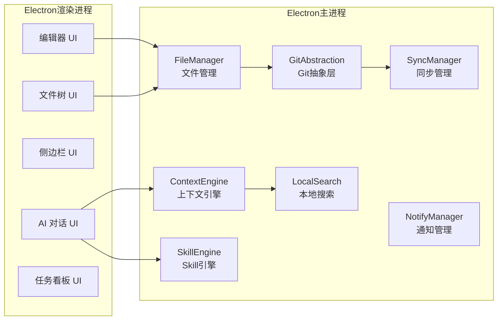
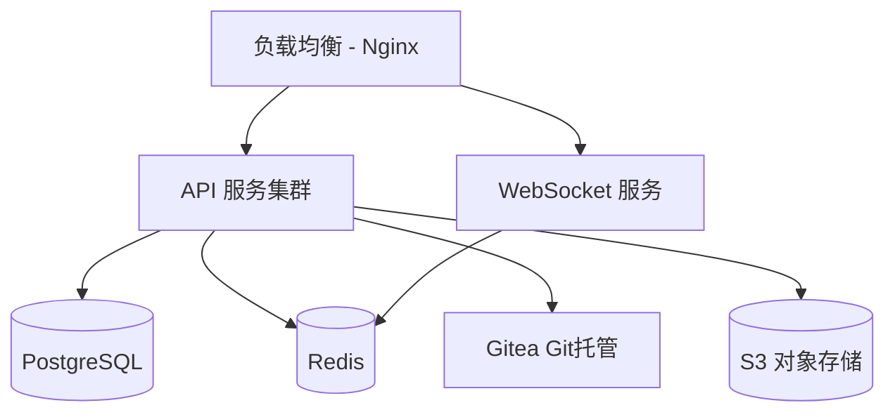

# 系统架构与技术选型

> 本文档定义 Sibylla 的整体系统架构、技术选型和核心模块划分。
> 所有架构决策必须符合 CLAUDE.md 中的设计哲学和架构约束。

---

## 一、架构总览

### 1.1 架构形态

Electron 桌面客户端 + 轻量云端服务。

- 客户端：编辑、本地存储、Git 操作、本地搜索、AI 交互
- 云端：用户认证、Git 托管、通知推送、语义搜索索引、AI 模型网关、积分账本

### 1.2 架构拓扑图



### 1.3 数据流概览



---

## 二、技术选型

### 2.1 客户端技术栈

| 层级 | 技术 | 说明 |
|------|------|------|
| 框架 | Electron | 跨平台桌面应用 |
| 渲染 | React 18+ | 组件化 UI |
| 语言 | TypeScript 严格模式 | 禁止 any |
| 样式 | TailwindCSS | 原子化 CSS |
| 状态管理 | Zustand | 轻量、TypeScript 友好 |
| 编辑器 | Tiptap v2 | 基于 ProseMirror 的 WYSIWYG |
| Git | isomorphic-git | 纯 JS Git 实现，无需系统 git |
| 本地数据库 | better-sqlite3 | 搜索索引、缓存 |
| IPC | Electron contextBridge | 安全的进程间通信 |
| 构建 | electron-builder | 打包分发 |
| 打包工具 | Vite | 快速开发构建 |

### 2.2 云端技术栈

| 层级 | 技术 | 说明 |
|------|------|------|
| 运行时 | Node.js + TypeScript | 与客户端统一语言 |
| Web 框架 | Fastify | 高性能 REST API |
| 数据库 | PostgreSQL | 用户、权限、积分等结构化数据 |
| 向量数据库 | pgvector | 语义搜索 embedding 存储 |
| Git 托管 | Gitea | 轻量自托管 Git 服务 |
| 缓存 | Redis | 会话、通知队列 |
| 认证 | JWT + Refresh Token | 无状态认证 |
| 对象存储 | S3 兼容 | 大文件、备份 |
| 部署 | Docker + Docker Compose | 容器化部署 |
| CI/CD | GitHub Actions | 自动构建与发布 |

### 2.3 AI 相关

| 组件 | 技术 | 说明 |
|------|------|------|
| 模型网关 | 自建代理层 | 统一代理 Claude/GPT/Gemini/DeepSeek |
| Embedding | OpenAI text-embedding-3-small | 语义搜索向量化 |
| MCP | @modelcontextprotocol/sdk | MCP 客户端集成 |
| Token 计算 | tiktoken | 上下文预算管理 |

---

## 三、核心模块架构

### 3.1 模块划分



### 3.2 进程通信架构

渲染进程与主进程严格隔离，通过 IPC 通信：

```
渲染进程                    主进程
  │                          │
  │── ipc:file:read ────────>│── FileManager.read()
  │<─ ipc:file:content ─────│
  │                          │
  │── ipc:file:write ───────>│── FileManager.write()
  │                          │── GitAbstraction.commit()
  │<─ ipc:file:saved ───────│
  │                          │
  │── ipc:ai:chat ──────────>│── ContextEngine.assemble()
  │                          │── AIGateway.send()
  │<─ ipc:ai:stream ────────│   (streaming response)
  │                          │
  │── ipc:search:query ─────>│── LocalSearch.search()
  │<─ ipc:search:results ───│
```

### 3.3 Git 抽象层接口

对上层暴露语义化接口，禁止上层直接调用 git 命令：

```typescript
interface GitAbstraction {
  // 文件操作
  saveFile(path: string, content: string): Promise<void>
  
  // 同步
  sync(): Promise<SyncResult>
  
  // 历史
  getHistory(path: string): Promise<VersionEntry[]>
  getFileDiff(commitA: string, commitB: string, path: string): Promise<Diff>
  
  // 冲突
  getConflicts(): Promise<ConflictInfo[]>
  resolveConflict(path: string, resolution: Resolution): Promise<void>
  
  // 审核
  submitForReview(paths: string[]): Promise<void>
  approveChanges(reviewId: string): Promise<void>
  rejectChanges(reviewId: string, reason: string): Promise<void>
}
```

---

## 四、上下文引擎架构

上下文引擎是 Sibylla 的核心差异化组件，负责为 AI 组装精准的项目上下文。

### 4.1 三层上下文模型

```mermaid
graph TB
    subgraph L1[第一层 - 始终加载]
        CLAUDE[CLAUDE.md 项目宪法]
        PersonalSpec[personal/_spec.md]
        CurrentFile[当前打开的文件]
    end

    subgraph L2[第二层 - 语义相关]
        SemanticSearch[语义搜索 Top 5-10 片段]
        FolderSpec[当前文件夹 _spec.md]
    end

    subgraph L3[第三层 - 手动引用]
        AtFile[@文件名 显式引用]
        AtMember[@成员名 工作内容]
    end

    L1 --> Assembler[上下文组装器]
    L2 --> Assembler
    L3 --> Assembler
    Assembler --> Budget[Token 预算管理]
    Budget --> Prompt[最终 Prompt]
```

### 4.2 Token 预算策略

- 优先保留：第一层（始终加载）+ 第三层（手动引用）
- 弹性压缩：第二层（语义相关）按相关性排序裁剪
- 预留空间：为模型回复预留至少 30% 的 token 窗口

---

## 五、部署架构

### 5.1 云端部署



### 5.2 客户端分发

- Mac: DMG + 自动更新（electron-updater）
- Windows: NSIS 安装包 + 自动更新
- 更新服务器: GitHub Releases 或自建

---

## 六、关键技术决策

| 决策项 | 选择 | 备选 | 理由 |
|--------|------|------|------|
| Git 实现 | isomorphic-git | nodegit / 系统 git | 纯 JS，无需系统依赖，跨平台一致 |
| 编辑器 | Tiptap v2 | Milkdown / BlockNote | 生态成熟，ProseMirror 底层可扩展性强 |
| 状态管理 | Zustand | Redux / Jotai | 轻量、TS 友好、无 boilerplate |
| 向量数据库 | pgvector | Pinecone / Weaviate | 与 PG 统一，运维简单，MVP 够用 |
| Git 托管 | Gitea | Gogs / GitLab | 轻量、Go 编写、资源占用低 |
