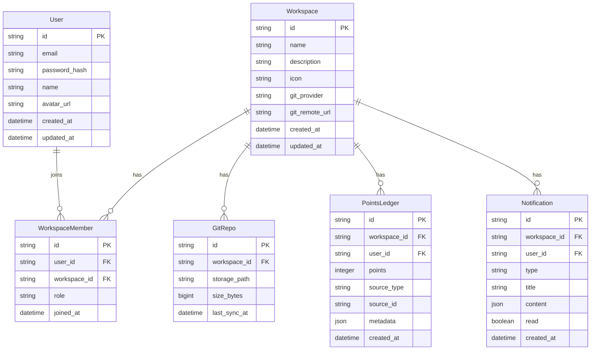

# 数据模型与 API 设计

> 本文档定义 Sibylla 的数据模型、文件结构和云端 API 接口。
> 所有设计必须遵循"文件即真相"原则——用户内容以明文文件存储，云端仅存储元数据和索引。

---

## 一、Workspace 文件结构

### 1.1 标准目录结构

```
Workspace-Root/
│
├── .sibylla/                        # 系统配置目录（用户不可见）
│   ├── config.json                  # workspace 全局设置
│   ├── members.json                 # 成员、角色、权限
│   ├── points.json                  # 积分配置与权重
│   ├── index/                       # 本地搜索索引缓存
│   │   └── sqlite.db               # SQLite 索引数据库
│   └── comments/                    # 评论元数据
│       └── {file-path}.comments.json
│
├── .git/                            # Git 目录（完全隐藏）
│
├── CLAUDE.md                        # 项目宪法（AI 始终加载）
├── requirements.md                  # 需求文档
├── design.md                        # 方案设计
├── tasks.md                         # 任务清单与进度
├── changelog.md                     # 变更日志（AI 自动维护）
├── tokenomics.md                    # 积分经济模型配置
│
├── skills/                          # 团队共享 Skill
│   ├── _index.md                    # Skill 目录索引
│   ├── writing-prd.md
│   └── ...
│
├── docs/                            # 团队文档主目录
│   ├── product/
│   │   ├── _spec.md                 # 产品组子 spec
│   │   └── prd/
│   ├── engineering/
│   ├── operations/
│   └── marketing/
│
├── personal/                        # 个人空间
│   ├── alice/
│   │   ├── _spec.md                 # 个人 spec
│   │   ├── _skills/                 # 个人 Skill
│   │   └── notes/
│   └── bob/
│
├── data/                            # 数据文件
│   └── *.csv
│
└── assets/                          # 附件
    └── images/
```

### 1.2 核心配置文件格式

#### config.json

```json
{
  "workspaceId": "ws-xxxxx",
  "name": "Sibylla 项目",
  "description": "团队知识协作平台",
  "icon": "🧠",
  "defaultModel": "claude-3-opus",
  "syncInterval": 30,
  "createdAt": "2024-01-01T00:00:00Z",
  "gitProvider": "sibylla",
  "gitRemote": "https://git.sibylla.io/ws-xxxxx"
}
```

#### members.json

```json
{
  "members": [
    {
      "id": "user-001",
      "name": "Alice",
      "email": "alice@example.com",
      "role": "admin",
      "avatar": "https://...",
      "joinedAt": "2024-01-01T00:00:00Z"
    }
  ],
  "invites": [
    {
      "email": "bob@example.com",
      "role": "editor",
      "invitedBy": "user-001",
      "expiresAt": "2024-01-15T00:00:00Z"
    }
  ]
}
```

#### tokenomics.md 格式

```markdown
# 积分经济模型

## 积分来源权重

| 来源 | 权重 | 说明 |
|------|------|------|
| 任务完成 | 40% | 按时完成有 1.2x 加成 |
| 文档贡献 | 30% | AI 评定质量高于基线有加成 |
| 协作贡献 | 20% | 评论回复、审核处理 |
| 质量加成 | 10% | 文档质量评分 |

## 结算周期

- 周期：每周一结算
- 流程：AI 计算 → 管理员审核 → 正式记录

## 分配模型

- 类型：二次方分配
- 参数：...
```

---

## 二、云端数据模型

### 2.1 核心实体关系



### 2.2 向量索引表

```sql
-- 文件向量索引（用于语义搜索）
CREATE TABLE file_embeddings (
    id UUID PRIMARY KEY DEFAULT gen_random_uuid(),
    workspace_id UUID NOT NULL REFERENCES workspaces(id),
    file_path VARCHAR(1024) NOT NULL,
    content_hash VARCHAR(64) NOT NULL,
    chunk_index INTEGER NOT NULL,
    chunk_text TEXT NOT NULL,
    embedding vector(1536) NOT NULL,
    created_at TIMESTAMP DEFAULT NOW(),
    updated_at TIMESTAMP DEFAULT NOW()
);

CREATE INDEX idx_embeddings_workspace ON file_embeddings(workspace_id);
CREATE INDEX idx_embeddings_path ON file_embeddings(file_path);
```

---

## 三、RESTful API 设计

### 3.1 API 规范

- 基础路径：`/api/v1/{resource}`
- 认证方式：JWT Bearer Token
- 响应格式：JSON
- 错误格式：

```json
{
  "error": {
    "code": "RESOURCE_NOT_FOUND",
    "message": "Workspace not found",
    "details": {}
  }
}
```

### 3.2 认证 API

```
POST   /api/v1/auth/register       # 注册
POST   /api/v1/auth/login           # 登录
POST   /api/v1/auth/refresh         # 刷新 Token
POST   /api/v1/auth/logout          # 登出
POST   /api/v1/auth/password/reset  # 重置密码
```

### 3.3 Workspace API

```
GET    /api/v1/workspaces                    # 获取用户所有 workspace
POST   /api/v1/workspaces                    # 创建 workspace
GET    /api/v1/workspaces/:id                # 获取 workspace 详情
PUT    /api/v1/workspaces/:id                # 更新 workspace 设置
DELETE /api/v1/workspaces/:id                # 删除 workspace

# 成员管理
GET    /api/v1/workspaces/:id/members        # 获取成员列表
POST   /api/v1/workspaces/:id/members/invite # 邀请成员
PUT    /api/v1/workspaces/:id/members/:uid    # 更新成员角色
DELETE /api/v1/workspaces/:id/members/:uid    # 移除成员
```

### 3.4 Git 托管 API

```
# Git 操作通过标准 HTTP Git 协议，Sibylla Cloud 仅提供认证和授权
# 以下为辅助 API

GET    /api/v1/git/:workspace_id/info          # 获取仓库信息
POST   /api/v1/git/:workspace_id/init          # 初始化仓库
GET    /api/v1/git/:workspace_id/commits       # 获取提交历史
GET    /api/v1/git/:workspace_id/diff/:commit  # 获取提交差异
```

### 3.5 AI 网关 API

```
POST   /api/v1/ai/chat                       # AI 对话（流式响应）
POST   /api/v1/ai/embeddings                  # 获取文本 embedding
POST   /api/v1/ai/summary                     # 生成文件摘要

# 请求示例
POST /api/v1/ai/chat
{
  "workspace_id": "ws-xxxxx",
  "model": "claude-3-opus",
  "mode": "plan",
  "messages": [...],
  "context": {
    "always_load": ["CLAUDE.md", "requirements.md"],
    "semantic_query": "会员体系方案",
    "manual_refs": ["docs/product/prd/membership.md"]
  }
}
```

### 3.6 搜索 API

```
POST   /api/v1/search/semantic               # 语义搜索
POST   /api/v1/search/index                   # 触发索引更新（webhook 调用）

# 请求示例
POST /api/v1/search/semantic
{
  "workspace_id": "ws-xxxxx",
  "query": "上次讨论的会员体系方案",
  "limit": 10
}

# 响应示例
{
  "results": [
    {
      "file_path": "docs/product/prd/membership.md",
      "chunk_text": "会员体系分为三个等级...",
      "relevance_score": 0.92
    }
  ]
}
```

### 3.7 通知 API

```
GET    /api/v1/notifications                  # 获取通知列表
PUT    /api/v1/notifications/:id/read         # 标记已读
PUT    /api/v1/notifications/read-all        # 全部标记已读
DELETE /api/v1/notifications/:id             # 删除通知

# WebSocket 通知推送
ws://api.sibylla.io/ws?token=xxx
```

### 3.8 积分 API

```
GET    /api/v1/points/balance                # 获取当前积分
GET    /api/v1/points/history                # 获取积分明细
POST   /api/v1/points/settle                  # 触发结算（管理员）
GET    /api/v1/points/leaderboard            # 获取排行榜
```

---

## 四、客户端本地数据结构

### 4.1 本地 SQLite 数据库

客户端使用 SQLite 存储索引和缓存：

```sql
-- 本地文件索引
CREATE TABLE files (
    path TEXT PRIMARY KEY,
    content_hash TEXT NOT NULL,
    last_modified INTEGER NOT NULL,
    size INTEGER NOT NULL,
    is_synced BOOLEAN DEFAULT TRUE,
    has_conflict BOOLEAN DEFAULT FALSE
);

-- 全文搜索索引
CREATE VIRTUAL TABLE files_fts USING fts5(
    path,
    content,
    tokenize = 'unicode61'
);

-- 评论元数据
CREATE TABLE comments (
    id TEXT PRIMARY KEY,
    file_path TEXT NOT NULL,
    position_start INTEGER,
    position_end INTEGER,
    author_id TEXT NOT NULL,
    content TEXT NOT NULL,
    status TEXT DEFAULT 'open',
    created_at INTEGER NOT NULL,
    updated_at INTEGER NOT NULL
);

-- 任务索引（从 tasks.md 解析）
CREATE TABLE tasks (
    id TEXT PRIMARY KEY,
    title TEXT NOT NULL,
    assignee TEXT,
    status TEXT DEFAULT 'todo',
    priority TEXT DEFAULT 'normal',
    due_date TEXT,
    related_files TEXT,
    source_file TEXT NOT NULL,
    line_number INTEGER
);
```

### 4.2 缓存策略

| 数据类型 | 缓存位置 | 过期策略 |
|---------|---------|---------|
| 文件内容 | 本地文件系统 | 实时 |
| 文件索引 | SQLite | 文件变更时更新 |
| 语义索引 | 云端 + SQLite 缓存 | Push 后云端更新 |
| 用户配置 | 内存 + SQLite | 启动时加载 |
| AI 对话历史 | SQLite | 永久保存 |
| 积分数据 | 内存 + SQLite | 每次打开 Dashboard 刷新 |

---

## 五、IPC 通信接口

### 5.1 文件操作

```typescript
// 渲染进程 → 主进程
ipc:file:read          (path: string) → string
ipc:file:write         (path: string, content: string) → void
ipc:file:delete        (path: string) → void
ipc:file:rename        (oldPath: string, newPath: string) → void
ipc:file:list          (dirPath: string) → FileInfo[]
ipc:file:import        (filePath: string) → ImportResult
ipc:file:export        (paths: string[], format: string) → void
```

### 5.2 Git 操作

```typescript
ipc:git:status         () → GitStatus
ipc:git:sync           () → SyncResult
ipc:git:history        (path: string) → Commit[]
ipc:git:diff           (commitA: string, commitB: string, path?: string) → Diff
ipc:git:resolve        (path: string, resolution: Resolution) → void
ipc:git:submitReview   (paths: string[]) → ReviewInfo
```

### 5.3 AI 操作

```typescript
ipc:ai:chat            (request: ChatRequest) → AsyncIterable<ChatChunk>
ipc:ai:embed           (text: string) → number[]
ipc:ai:search          (query: string, options?: SearchOptions) → SearchResult[]
ipc:ai:applyEdit       (path: string, diff: string) → ApplyResult
```

### 5.4 搜索操作

```typescript
ipc:search:local       (query: string) → LocalSearchResult[]
ipc:search:semantic    (query: string) → Promise<SemanticSearchResult[]>
ipc:search:buildIndex  () → void
```

---

## 六、WebSocket 事件

### 6.1 客户端订阅事件

```typescript
// 连接
ws://api.sibylla.io/ws?token=xxx&workspace_id=xxx

// 事件类型
{
  "event": "file_changed",
  "data": {
    "path": "docs/product/prd.md",
    "author": "user-002",
    "summary": "更新了会员体系方案"
  }
}

{
  "event": "task_assigned",
  "data": {
    "task_id": "task-001",
    "title": "完成 PRD 初稿"
  }
}

{
  "event": "mention",
  "data": {
    "file_path": "docs/product/prd.md",
    "comment_id": "comment-001",
    "content": "@Alice 请看一下这个方案"
  }
}

{
  "event": "review_required",
  "data": {
    "review_id": "review-001",
    "files": ["docs/finance/budget.md"],
    "author": "user-003"
  }
}