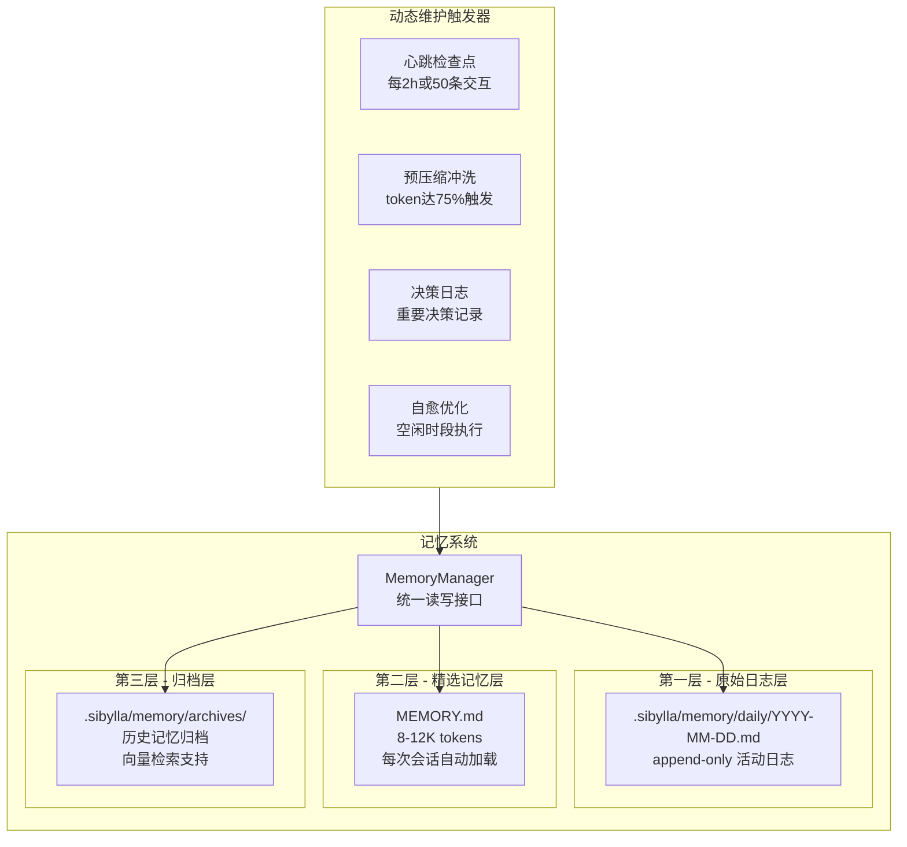

# 团队记忆系统设计

> 本文档定义 Sibylla 的企业级团队记忆系统架构、存储格式和维护机制。
> 所有设计必须遵循 CLAUDE.md 第五条"记忆即演化"原则。

---

## 一、架构总览

### 1.1 设计目标

- 支持多用户协作场景下的知识积累、检索和演化
- 三层分层存储：原始日志 → 精选记忆 → 归档
- 日志不可篡改（append-only），精选记忆动态维护，归档支持语义检索
- 个人空间内容不进入团队记忆

### 1.2 系统架构图



### 1.3 存储路径规划

```
Workspace-Root/
├── MEMORY.md                              # 精选记忆（workspace 根目录）
├── .sibylla/
│   └── memory/
│       ├── daily/                          # 原始日志层
│       │   ├── 2026-03-01.md
│       │   └── 2026-03-02.md
│       ├── archives/                       # 归档层
│       │   ├── milestone-v0.1.md
│       │   └── weekly-2026-w09.md
│       ├── decisions/                      # 决策日志
│       │   └── dec-2026-03-02-001.md
│       ├── index/                          # 检索索引
│       │   ├── vectors.db                  # 向量索引（SQLite + vec扩展）
│       │   └── metadata.db                 # 元数据索引
│       └── config.json                     # 记忆系统配置
```

---

## 二、三层存储设计

### 2.1 第一层 — 原始日志层

**存储路径**：`.sibylla/memory/daily/YYYY-MM-DD.md`

**特性**：
- append-only 模式，禁止修改已写入内容
- 每条记录包含完整上下文元数据
- 结构化 Markdown 格式

**日志条目格式**：

```markdown
---
<!-- entry-start -->
**时间**: 2026-03-02T14:30:00+08:00
**类型**: user-interaction | command-exec | file-operation | decision | error | system
**操作者**: alice
**会话ID**: session-abc123
**摘要**: 用户询问会员体系方案，AI 基于 PRD 给出三级会员建议
**详情**:
- 用户输入: 帮我分析一下会员体系应该怎么设计
- AI 响应摘要: 建议三级会员体系（基础/高级/企业），附带定价策略
- 引用文件: docs/product/prd/membership.md
**标签**: #会员体系 #产品设计 #AI对话
**关联文件**: docs/product/prd/membership.md, CLAUDE.md
<!-- entry-end -->
---
```

### 2.2 第二层 — 精选记忆层

**存储路径**：workspace 根目录 `MEMORY.md`

**特性**：
- 维持 8,000-12,000 tokens 范围
- 每次会话自动加载到 AI 上下文
- LLM 智能提取高价值信息
- 分类索引结构，支持快速定位

**MEMORY.md 结构规范**：

```markdown
# 团队记忆

> 最后更新: 2026-03-02T14:30:00+08:00
> Token 估算: ~9,200 tokens
> 版本: v42

## 用户偏好
- Alice: 偏好简洁的技术文档风格，常用模型 Claude Opus
- Bob: 偏好详细的方案对比分析，关注性能指标

## 项目约定
- 文档语言: 中文，代码注释: 英文
- API 设计遵循 RESTful 规范
- 前端使用 React + TailwindCSS

## 技术决策
### 状态管理选型 - Zustand
- 决策日期: 2026-02-15
- 理由: 轻量、TS 友好、无 boilerplate
- 参考: specs/design/architecture.md

## 常见问题
### Electron IPC 通信超时
- 现象: 大文件操作时 IPC 响应超过 5s
- 解决: 分片传输 + 进度回调

## 当前焦点
- Phase 0 基础设施搭建进行中
- 优先完成 Electron + IPC + Git 抽象层
```

**Token 管理策略**：

| 操作 | 触发条件 | 行为 |
|------|---------|------|
| 追加 | 新高价值信息提取 | 添加到对应分类下 |
| 压缩 | tokens > 12,000 | LLM 合并相似条目、移除低价值信息 |
| 归档 | 信息过时或相关性低 | 移至 archives/ 并更新索引 |

### 2.3 第三层 — 归档层

**存储路径**：`.sibylla/memory/archives/`

**特性**：
- 按时间或主题归档的历史记忆
- 每个归档文件包含向量嵌入索引
- 支持语义检索

**归档触发条件**：

| 条件 | 阈值 | 说明 |
|------|------|------|
| 时间阈值 | 30 天未访问 | 自动标记为归档候选 |
| 相关性评分 | < 0.3 | LLM 评估当前相关性 |
| 里程碑完成 | Phase 切换时 | 自动生成里程碑归档 |
| MEMORY.md 溢出 | > 12K tokens | 低优先级内容归档 |

---

## 三、动态维护机制

### 3.1 心跳检查点（Heartbeat Checkpoints）

**触发条件**：每 2 小时 或 每 50 条交互（以先到者为准）

**流程**：
1. 读取最近日志条目
2. 读取当前精选记忆
3. LLM 分析并提取关键学习点/决策/用户偏好
4. 更新精选记忆
5. 写入检查点记录

**检查点输出格式**：

```markdown
<!-- checkpoint -->
**检查点**: 2026-03-02T16:00:00+08:00
**触发原因**: 定时（2h）
**分析范围**: 最近 23 条日志
**变更摘要**:
- 新增用户偏好: Alice 偏好表格形式的方案对比（置信度: 0.85）
- 更新技术决策: 确认使用 pgvector 作为向量存储（置信度: 0.95）
**MEMORY.md 变更**: +3 条目, -0 条目, ~1 条目更新
<!-- checkpoint-end -->
```

### 3.2 预压缩内存冲洗（Silent Memory Flush）

**触发条件**：会话 token 使用量达到上下文窗口的 75%

**冲洗策略**：

| 信息类型 | 优先级 | 持久化目标 |
|---------|--------|-----------|
| 未完成任务 | P0 | MEMORY.md + 日志 |
| 临时决策 | P0 | 日志 + 决策记录 |
| 重要发现 | P1 | MEMORY.md |
| 对话上下文摘要 | P1 | 日志 |
| 中间推理过程 | P2 | 仅日志 |

### 3.3 决策日志（Decision Logging）

**存储路径**：`.sibylla/memory/decisions/dec-YYYY-MM-DD-NNN.md`

**决策记录格式**：

```markdown
# 决策: 状态管理方案选型

> ID: dec-2026-03-02-001
> 日期: 2026-03-02
> 状态: accepted
> 决策者: Alice, Bob

## 问题描述
Electron 渲染进程需要一个状态管理方案，要求 TypeScript 友好、轻量、易于测试。

## 可选方案
- 方案 A: Zustand - 轻量、零 boilerplate
- 方案 B: Redux Toolkit - 生态成熟、DevTools 强大
- 方案 C: Jotai - 原子化状态

## 最终选择
方案 A: Zustand

## 选择理由
符合项目轻量化原则，TS 严格模式下体验最佳。
```

### 3.4 自愈与优化（Self-Healing）

**执行时段**：凌晨 2:00-4:00（用户本地时间）或用户手动触发

**自愈任务清单**：

| 任务 | 频率 | 说明 |
|------|------|------|
| 重复检测 | 每日 | 基于语义相似度合并重复条目 |
| 过时检测 | 每日 | 标记超过 30 天未引用的信息 |
| 孤立关联 | 每周 | 为无关联的记忆片段建立主题链接 |
| 知识图谱 | 每周 | 更新主题间的关系图 |
| 索引优化 | 每周 | 重建向量索引、清理无效条目 |

---

## 四、Memory Manager API 设计

### 4.1 核心接口定义

```typescript
interface MemoryManager {
  // 日志操作
  appendLog(entry: LogEntry): Promise<void>
  queryLogs(query: LogQuery): Promise<LogEntry[]>
  
  // 精选记忆操作
  getMemory(): Promise<Memory>
  updateMemory(updates: MemoryUpdate[]): Promise<void>
  compressMemory(): Promise<CompressionResult>
  
  // 归档操作
  createArchive(archive: Archive): Promise<string>
  queryArchives(query: ArchiveQuery): Promise<Archive[]>
  
  // 决策日志
  logDecision(decision: Decision): Promise<string>
  updateDecisionResult(id: string, result: DecisionResult): Promise<void>
  
  // 检索操作
  semanticSearch(query: string, options?: SearchOptions): Promise<SearchResult[]>
  fullTextSearch(query: string, options?: SearchOptions): Promise<SearchResult[]>
  
  // 维护操作
  triggerCheckpoint(): Promise<CheckpointResult>
  runSelfHealing(): Promise<HealingReport>
  getHealthReport(): Promise<HealthReport>
}
```

### 4.2 核心数据类型

```typescript
interface LogEntry {
  timestamp: string
  type: 'user-interaction' | 'command-exec' | 'file-operation' | 'decision' | 'error' | 'system'
  operator: string
  sessionId: string
  summary: string
  details: Record<string, any>
  tags: string[]
  relatedFiles: string[]
}

interface Memory {
  version: number
  lastUpdated: string
  tokenCount: number
  sections: MemorySection[]
}

interface MemoryUpdate {
  action: 'add' | 'update' | 'remove'
  section: string
  content?: string
  reason: string
  confidence: number
}

interface Archive {
  id: string
  title: string
  type: 'milestone' | 'weekly' | 'topic' | 'manual'
  content: string
  metadata: {
    createdAt: string
    sources: string[]
    tags: string[]
  }
}

interface Decision {
  title: string
  problem: string
  options: DecisionOption[]
  chosen: string
  reason: string
  deciders: string[]
  relatedFiles: string[]
}
```

---

## 五、向量检索引擎

### 5.1 技术选型

| 组件 | 技术 | 说明 |
|------|------|------|
| 本地 Embedding | @xenova/transformers | 浏览器/Node.js 运行的 ONNX 模型 |
| 模型 | all-MiniLM-L6-v2 | 384 维，轻量高效 |
| 向量存储 | SQLite + sqlite-vec | 轻量级向量扩展 |
| 相似度计算 | 余弦相似度 | 标准语义检索算法 |

### 5.2 混合检索策略

结合向量检索（语义相关）和全文检索（关键词匹配），使用 RRF（Reciprocal Rank Fusion）融合排序：

- 向量检索权重: 0.7
- 全文检索权重: 0.3

---

## 六、记忆查询 DSL

### 6.1 查询语法

```
# 基础查询
会员体系方案

# 时间范围
会员体系方案 date:2026-03-01..2026-03-07

# 标签过滤
会员体系方案 tag:产品设计 tag:AI对话

# 来源过滤
会员体系方案 source:memory
会员体系方案 source:log,archive

# 组合查询
会员体系方案 date:2026-03 tag:产品设计 source:memory,log by:alice
```

---

## 七、记忆统计与可视化

### 7.1 统计指标

```typescript
interface MemoryStatistics {
  storage: {
    totalLogs: number
    memoryTokens: number
    archiveCount: number
  }
  
  quality: {
    duplicationRate: number
    staleRate: number
    orphanRate: number
    hitRate: number
  }
  
  usage: {
    searchCount: number
    topQueries: Array<{ query: string; count: number }>
  }
}
```

### 7.2 可视化 Dashboard

UI 组件位置：右侧边栏 → 记忆面板

显示内容：
- 精选记忆 token 使用进度条
- 日志/归档/决策统计
- 质量指标（重复率、过时率、孤立率、命中率）
- 最近活动时间线
- 操作按钮（查看详细报告、执行维护、导出记忆）

### 7.3 知识图谱可视化

使用 D3.js 或 Cytoscape.js 展示主题关联：

- 节点类型：topic、file、decision、person
- 边类型：references、related、decided-by、authored-by
- 节点权重：基于提及次数
- 边权重：基于关联强度

---

## 八、安全与隐私

### 8.1 个人空间隔离

严格遵循 CLAUDE.md 第七节安全红线：

- 排除其他成员的个人空间内容
- 管理员访问个人空间时显示警告
- 搜索结果自动过滤个人空间

### 8.2 敏感信息检测

自动检测并标记敏感信息：
- API Key、密码、邮箱、电话、信用卡号
- 在日志写入前检测并警告用户
- 可选自动脱敏功能

---

## 九、实施路线图

### 9.1 Sprint 3（Phase 1）- 基础架构

- [ ] 实现 MemoryManager 核心接口
- [ ] 实现日志追加功能（append-only）
- [ ] 实现 MEMORY.md 读写
- [ ] 实现文件锁机制
- [ ] 集成到上下文引擎

### 9.2 Sprint 4（Phase 2）- 精选记忆与检索

- [ ] 实现心跳检查点
- [ ] 实现精选记忆提取（LLM）
- [ ] 实现本地向量检索
- [ ] 实现全文搜索
- [ ] 实现混合检索策略

### 9.3 Sprint 6（Phase 2）- 归档与决策

- [ ] 实现归档功能
- [ ] 实现决策日志
- [ ] 实现预压缩冲洗
- [ ] 实现记忆压缩

### 9.4 Sprint 7（Phase 3）- 优化与可视化

- [ ] 实现自愈任务
- [ ] 实现可视化 Dashboard
- [ ] 实现知识图谱
- [ ] 实现查询 DSL
- [ ] 性能优化

---

## 十、关键技术决策

| 决策项 | 选择 | 理由 |
|--------|------|------|
| 向量模型 | all-MiniLM-L6-v2 | 本地运行，无需 API 调用 |
| 向量存储 | SQLite + sqlite-vec | 轻量、本地优先、无额外依赖 |
| 日志格式 | 结构化 Markdown | 人类可读、易于 Git diff |
| 检索策略 | 混合检索（向量+全文） | 兼顾语义和关键词匹配 |
| 维护触发 | 定时 + 事件驱动 | 灵活响应不同场景 |

---

## 十一、参考资料

- CLAUDE.md - 项目宪法与设计哲学
- specs/design/architecture.md - 系统架构设计
- specs/design/data-and-api.md - 数据模型与 API
- @xenova/transformers - 本地 Embedding 库
- sqlite-vec - SQLite 向量扩展

---

**文档版本**: v2.0（精简版）  
**最后更新**: 2026-03-02  
**维护者**: Sibylla 架构团队
