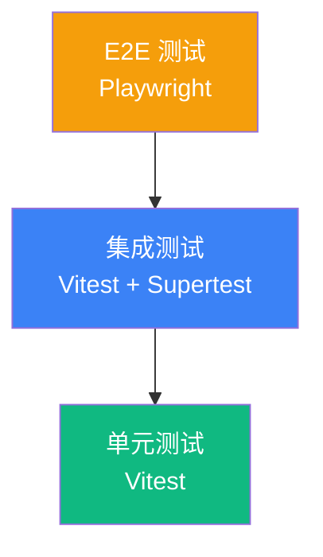
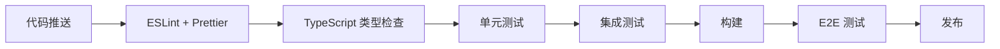

# 测试与安全策略

> 本文档定义 Sibylla 的测试策略、质量保障流程和安全设计规范。
> 安全红线参见 CLAUDE.md 第七节。

---

## 一、测试策略

### 1.1 测试金字塔

| 层级 | 工具 | 覆盖率目标 | 说明 |
|------|------|-----------|------|
| 单元测试 | Vitest | ≥ 80% | 核心逻辑、工具函数、数据转换 |
| 集成测试 | Vitest + Supertest | ≥ 60% | API 接口、IPC 通信、Git 抽象层 |
| E2E 测试 | Playwright | 核心流程覆盖 | 用户关键路径 |

### 1.2 测试范围

#### 客户端测试重点

- Git 抽象层：保存、同步、冲突检测、版本回滚
- 上下文引擎：三层上下文组装、Token 预算裁剪
- Skill 引擎：Skill 解析、匹配、调用
- 文件管理器：CRUD、导入转换、原子写入
- 本地搜索：全文索引构建、查询准确性

#### 云端测试重点

- 认证流程：注册、登录、Token 刷新、权限校验
- Git 托管：仓库创建、push/pull 鉴权
- 语义搜索：embedding 生成、相似度查询
- 积分引擎：计算准确性、结算流程
- 通知服务：WebSocket 推送、消息投递

#### E2E 关键路径

1. 创建 workspace → 初始化标准结构 → 验证文件生成
2. 导入文件 → 自动转换 → 验证 Markdown 输出
3. 编辑文件 → 自动保存 → 自动同步 → 另一端验证
4. AI 对话 → @引用文件 → 验证上下文组装 → 验证回复质量
5. 冲突产生 → 冲突界面展示 → 选择解决方案 → 验证合并结果

### 1.3 测试规范

- 测试文件与源文件同目录，命名 `*.test.ts` 或 `*.spec.ts`
- 每个 PR 必须包含对应测试，CI 不通过不可合并
- Mock 外部依赖（AI API、Git 远程、网络请求）
- 测试数据使用 fixtures，不依赖外部状态

---

## 二、质量保障流程

### 2.1 CI/CD 流水线

### 2.2 代码质量工具

| 工具 | 用途 |
|------|------|
| ESLint | 代码规范检查 |
| Prettier | 代码格式化 |
| TypeScript strict | 类型安全 |
| Husky + lint-staged | 提交前检查 |
| Vitest | 测试运行 |
| Playwright | E2E 测试 |

### 2.3 发布流程

- 版本号遵循 SemVer
- 每次发布前运行完整测试套件
- Electron 安装包自动构建（Mac DMG + Windows NSIS）
- 自动更新通过 electron-updater 分发

---

## 三、安全设计

### 3.1 安全红线（来自 CLAUDE.md）

1. 用户 API Key 加密存储在本地，不上传云端
2. 云端数据传输全程 HTTPS，静态加密存储
3. 积分账本 append-only，不可篡改历史
4. 个人空间内容不出现在其他成员的 AI 上下文中

### 3.2 认证与授权

| 机制 | 实现 |
|------|------|
| 用户认证 | JWT + Refresh Token |
| Token 有效期 | Access: 15min, Refresh: 7d |
| 密码存储 | bcrypt, cost factor ≥ 12 |
| API 鉴权 | 所有接口 JWT 校验（除登录/注册） |
| 权限模型 | RBAC: Admin / Editor / Viewer |

### 3.3 数据安全

- 本地 API Key 使用 Electron safeStorage 加密
- 云端 PostgreSQL 启用 TDE（透明数据加密）
- Git 传输使用 HTTPS + Token 认证
- 文件写入采用临时文件 + 原子替换，防止数据丢失

### 3.4 客户端安全

- Electron contextIsolation 启用
- nodeIntegration 禁用
- CSP（Content Security Policy）严格配置
- 渲染进程不直接访问文件系统或 Git
- 自动更新签名验证

### 3.5 云端安全

- 所有 API 限流（Rate Limiting）
- SQL 注入防护（参数化查询）
- XSS 防护（输出编码）
- CORS 白名单配置
- 日志脱敏（不记录敏感信息）

### 3.6 隐私保护

- 个人空间 `personal/[name]/` 权限隔离
- AI 上下文组装时自动排除无权限文件
- 云端不存储用户文档原文（仅 embedding 向量）
- 用户可随时导出并删除所有数据
