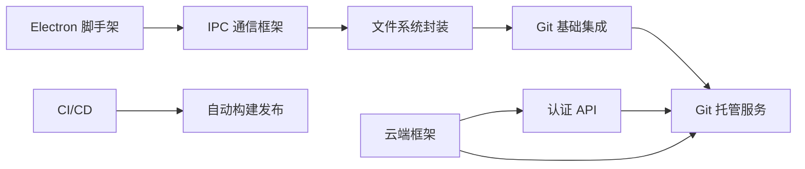

# Phase 0 - 基础设施搭建

> 目标：跑通最小技术栈，验证核心技术选型可行性。

---

## 阶段目标

建立 Sibylla 项目的技术基础，实现最小可运行链路：

1. Electron 应用能够启动并展示基础 UI
2. 本地文件系统读写正常工作
3. Git 基础操作（init/add/commit/push/pull）可用
4. 云端认证服务和 Git 托管服务基础可用
5. CI/CD 流水线能够自动构建和发布

## 里程碑定义

**Phase 0 完成标志：** 能够创建 workspace、编辑文件、自动 commit、push 到 Sibylla Git Host、另一台电脑 pull 下来看到变更。

## 需求文档

| 文档 | 涉及模块 | 说明 |
|------|---------|------|
| [`infrastructure-setup.md`](infrastructure-setup.md) | 基础设施 | Electron 脚手架、云端框架、CI/CD |
| [`file-system-git-basic.md`](file-system-git-basic.md) | 模块1（部分）、模块3（部分） | 文件系统基础与 Git 基础集成 |

## 技术栈确认

本阶段需确认并验证以下技术选型（参见 [`architecture.md`](../../design/architecture.md)）：

- 客户端：Electron + React 18 + TypeScript + Vite + TailwindCSS
- 状态管理：Zustand
- Git：isomorphic-git
- 云端：Node.js + Fastify + PostgreSQL + Gitea
- 部署：Docker + GitHub Actions

## 依赖关系

Phase 0 是所有后续阶段的前置依赖，必须全部完成后才能进入 Phase 1。
