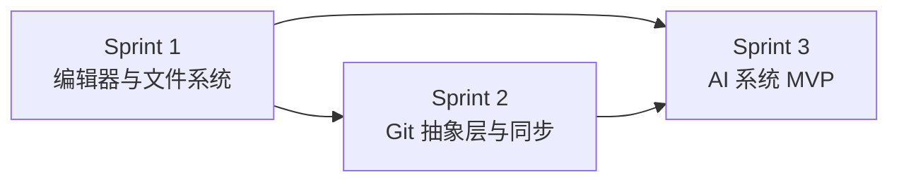

# Phase 1 - MVP 核心体验

> 目标：实现核心体验闭环——"团队在 Sibylla 中协作编辑文档，AI 拥有全局上下文并产出高质量结果"。

---

## 阶段目标

交付可内测的桌面应用，覆盖以下核心场景：

1. 创建 workspace → 导入文件 → 编辑文档
2. 自动保存 → 自动同步 → 多端协作
3. AI 对话（带全局上下文）→ AI 修改文件

## 里程碑定义

**Phase 1 完成标志：** 可安装的 Electron 桌面应用（Mac + Windows），核心功能闭环可用，可交付 2-3 个内测团队使用。

## Sprint 规划

| Sprint | 主题 | 涉及模块 | 文档 |
|--------|------|---------|------|
| Sprint 1 | 编辑器与文件系统 | 模块1、模块2、模块14（基础） | [`sprint1-editor-filesystem.md`](sprint1-editor-filesystem.md) |
| Sprint 2 | Git 抽象层与同步 | 模块3、模块12（基础） | [`sprint2-git-sync.md`](sprint2-git-sync.md) |
| Sprint 3 | AI 系统 MVP | 模块4、模块5、模块6、模块7、模块15（基础） | [`sprint3-ai-mvp.md`](sprint3-ai-mvp.md) |

## 前置依赖

Phase 0 的所有需求必须完成：
- Electron 应用脚手架 ✓
- IPC 通信框架 ✓
- 文件系统基础 ✓
- Git 基础集成 ✓
- 云端服务框架 ✓
- CI/CD 流水线 ✓

## Sprint 间依赖关系

Sprint 1 是 Sprint 2 和 Sprint 3 的前置依赖。Sprint 2 和 Sprint 3 部分可并行，但 Sprint 3 的 AI 文件修改功能依赖 Sprint 2 的同步机制。
