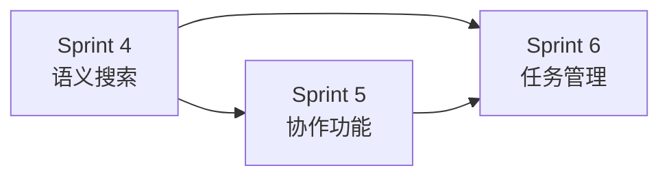

# Phase 2 - 协作闭环

> 目标：补齐团队协作所需的信息流通能力，让 Sibylla 从"能用"变成"好用"。

---

## 阶段目标

完善团队协作体验，实现以下核心场景：

1. AI 能够通过语义搜索找到相关文档
2. 团队成员能够通过通知、评论、审核进行异步协作
3. 任务管理与日报自动化

## 里程碑定义

**Phase 2 完成标志：** 完整的团队协作体验，内测团队扩大到 5-10 个，用户反馈协作流程顺畅。

## Sprint 规划

| Sprint | 主题 | 涉及模块 | 文档 |
|--------|------|---------|------|
| Sprint 4 | 语义搜索与上下文增强 | 模块7（语义搜索）、模块4（上下文 v2）、模块15（精选记忆） | [`sprint4-semantic-search.md`](sprint4-semantic-search.md) |
| Sprint 5 | 通知、评论、审核 | 模块8、模块9、模块3（审核） | [`sprint5-collaboration.md`](sprint5-collaboration.md) |
| Sprint 6 | 任务管理与日报 | 模块10（基础版）、模块12（完整版）、模块15（归档与决策） | [`sprint6-task-management.md`](sprint6-task-management.md) |

## 前置依赖

Phase 1 的所有需求必须完成：
- 编辑器与文件系统 ✓
- Git 抽象层与同步 ✓
- AI 系统 MVP ✓

## Sprint 间依赖关系

Sprint 4 是 Sprint 5 和 Sprint 6 的前置依赖。Sprint 5 和 Sprint 6 部分可并行。
