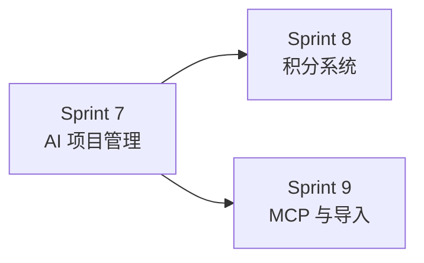

# Phase 3 - 智能管理与激励

> 目标：释放 AI 项目管理能力和积分激励系统，形成差异化壁垒。

---

## 阶段目标

实现 Sibylla 的差异化功能，包括：

1. AI 深度参与项目管理（状态追踪、产出分析、决策建议）
2. 积分系统实现价值量化和激励
3. MCP 外部集成扩展能力边界
4. 增强的文件导入体验

## 里程碑定义

**Phase 3 完成标志：** 差异化功能完备，可面向目标用户公开推广，形成"AI 项目管理 + 积分激励"的独特价值主张。

## Sprint 规划

| Sprint | 主题 | 涉及模块 | 文档 |
|--------|------|---------|------|
| Sprint 7 | AI 项目管理完整版 | 模块10（完整版）、模块15（自愈与可视化） | [`sprint7-ai-pm-full.md`](sprint7-ai-pm-full.md) |
| Sprint 8 | 积分系统 | 模块11 | [`sprint8-points-system.md`](sprint8-points-system.md) |
| Sprint 9 | MCP 与导入增强 | 模块13、模块14（增强版） | [`sprint9-mcp-import.md`](sprint9-mcp-import.md) |

## 前置依赖

Phase 2 的所有需求必须完成：
- 语义搜索与上下文增强 ✓
- 通知、评论、审核 ✓
- 任务管理与日报基础版 ✓

## Sprint 间依赖关系

Sprint 7 是 Sprint 8 的前置依赖（积分计算依赖工作产出分析）。Sprint 9 可与 Sprint 8 并行。
