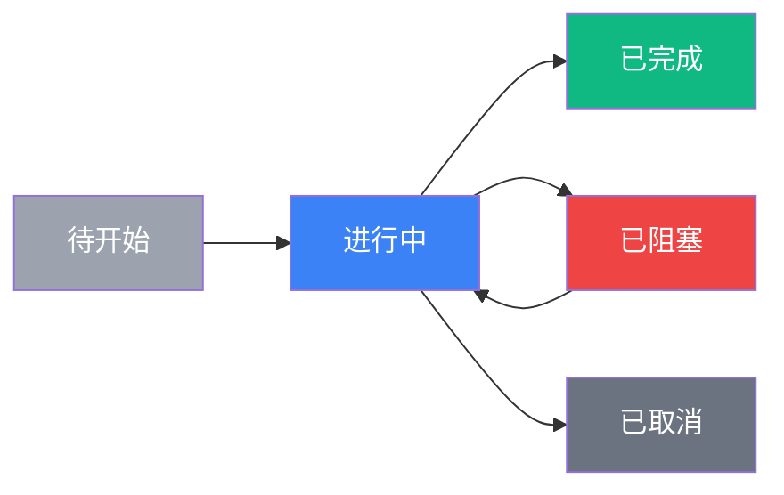

# Sibylla 项目任务分解总览

> 本文档提供 Sibylla 项目所有阶段的任务分解概览和规划指南。

---

## 项目阶段概览

---

## Phase 0：基础设施搭建（当前阶段）

**状态：** 🔄 进行中  
**目标：** 跑通最小技术栈  
**任务数：** 15 个  
**预估工时：** 28-40 工作日  
**完成进度：** 0/15 (0%)

### 关键交付物

- ✅ Electron 桌面应用脚手架
- ✅ 云端服务框架
- ✅ Git 抽象层基础实现
- ✅ 文件系统操作封装
- ✅ CI/CD 自动构建流水线

### 详细文档

- [Phase 0 README](phase0/README.md)
- [Phase 0 任务清单](phase0/task-list.md)
- [任务文件模板](TASK_TEMPLATE.md)

---

## Phase 1：MVP 核心体验

**状态：** ⬜ 待开始  
**目标：** 实现核心体验闭环  
**预估任务数：** 25-30 个  
**预估工时：** 60-80 工作日  
**依赖：** Phase 0 完成

### 阶段目标

实现"团队在 Sibylla 中协作编辑文档，AI 拥有全局上下文并产出高质量结果"的完整闭环。

### Sprint 划分

#### Sprint 1 - 编辑器与文件系统（2-3周）

**涉及模块：**
- 模块1：文件系统与存储（完整版）
- 模块2：WYSIWYG 编辑器（基础版）
- 模块14：迁移与导入（基础版）

**关键任务：**
- Tiptap 编辑器集成
- Markdown 渲染和编辑
- 文件导入转换（Word/Notion/飞书）
- 文件树 UI 实现
- 文件搜索功能

#### Sprint 2 - Git 抽象层与同步（2-3周）

**涉及模块：**
- 模块3：Git 抽象层（完整版）
- 模块12：权限与访问控制（基础版）

**关键任务：**
- 自动保存与提交
- 自动同步（push/pull）
- 冲突检测与基础合并
- 版本历史浏览
- Workspace 成员管理

#### Sprint 3 - AI 系统 MVP（3-4周）

**涉及模块：**
- 模块4：AI 系统（MVP 版）
- 模块5：Skill 系统（v1）
- 模块6：Spec 工作流
- 模块7：搜索系统（本地全文搜索）

**关键任务：**
- 上下文引擎 v1（三层模型）
- AI 主对话窗口
- AI 侧边栏
- Skill 系统实现
- Spec 工作流
- 本地全文搜索

### 里程碑

**Phase 1 完成标志：** 可交付内测的桌面应用，核心功能可用。

---

## Phase 2：协作闭环

**状态：** ⬜ 待开始  
**目标：** 补齐团队协作所需的信息流通能力  
**预估任务数：** 20-25 个  
**预估工时：** 50-70 工作日  
**依赖：** Phase 1 完成

### 阶段目标

实现完整的团队协作体验，包括语义搜索、通知、评论、审核和任务管理。

### Sprint 划分

#### Sprint 4 - 语义搜索与上下文增强（2-3周）

**涉及模块：**
- 模块7：搜索系统（语义搜索）
- 模块4：AI 系统（上下文引擎 v2）

**关键任务：**
- 云端语义搜索服务
- Embedding 生成和索引
- 上下文引擎 v义搜索）
- 搜索结果展示优化

#### Sprint 5 - 通知、评论、审核（2-3周）

**涉及模块：**
- 模块8：通知与信息流
- 模块9：评论与讨论
- 模块3：Git 抽象层（审核流程）

**关键任务：**
- 通知服务实现
- WebSocket 实时推送
- 评论系统实现
- 审核流程实现
- @提及功能

#### Sprint 6 - 任务管理与日报（2-3周）

**涉及模块：**
- 模块10：AI 项目管理（基础版）
- 模块12：权限与访问控制（完整版）

**关键任务：**
- 任务看板 UI
- 任务解析和同步
- AI 日报生成
- 权限系统完善

### 里程碑

**Phase 2 完成标志：** 完整的团队协作体验，内测团队扩大到 5-10 个。

---

## Phase 3：智能管理与激励

**状态：** ⬜ 待开始  
**目标：** 释放 AI 项目管理能力和积分激励系统  
**预估任务数：** 15-20 个  
**预估工时：** 40-60 工作日  
**依赖：** Phase 2 完成

### 阶段目标

实现差异化功能，包括 AI 项目管理、积分系统和 MCP 集成。

### Sprint 划分

#### Sprint 7 - AI 项目管理（2-3周）

**涉及模块：**
- 模块10：AI 项目管理（完整版）

**关键任务：**
- AI 任务分解
- AI 进度跟踪
- AI 风险预警
- AI 资源优化建议

#### Sprint 8 - 积分系统（2-3周）

**涉及模块：**
- 模块11：积分系统

**关键任务：**
- 积分计算引擎
- 积分账本实现
- 积分结算流程
- 积分排行榜
- 积分可视化

#### Sprint 9 - MCP 与导入增强（2-3周）

**涉及模块：**
- 模块13：MCP 外部集成
- 模块14：迁移与导入（增强版）

**关键任务：**
- MCP 客户端集成
- MCP Hub 实现
- 导入功能增强
- 外部工具集成

### 里程碑

**Phase 3 完成标志：** 差异化功能完备，可面向目标用户公开推广。

---

## 任务分解原则

### 任务粒度控制

- **单个任务工作量：** 0.5-3 工作日
- **任务独立性：** 每个任务应可独立开发、测试和交付
- **任务可验收：** 每个任务有明确的验收标准

### 任务命名规范

**格式：** `PHASE{阶段编号}-TASK{任务编号}_{简短描述}`

**示例：**
- `PHASE0-TASK001_electron-scaffold`
- `PHASE1-TASK015_ai-context-engine`
- `PHASE2-TASK008_semantic-search-service`

### 任务文件结构

每个任务文件必须包含以下章节：

1. **任务信息** - ID、标题、阶段、优先级、复杂度、工时
2. **任务描述** - 目标、背景、范围
3. **技术要求** - 技术栈、架构设计、实现细节
4. **验收标准** - 功能、性能、UX、代码质量
5. **测试标准** - 单元测试、集成测试、E2E 测试
6. **依赖关系** - 前置依赖、被依赖任务、阻塞风险
7. **风险评估** - 技术风险、时间风险、资源风险
8. **参考文档** - 相关设计文档和需求文档
9. **实施计划** - 分步骤的实施计划
10. **完成标准** - 明确的完成标志和交付物

### 优先级定义

- **P0（必须完成）：** 阻塞发布，核心功能
- **P1（应该完成）：** 影响核心体验，重要功能
- **P2（可以延后）：** 锦上添花，优化功能

### 复杂度评估

- **简单：** 1-2 天，技术成熟，风险低
- **中等：** 2-3 天，需要一定设计，风险中等
- **复杂：** 3-4 天，技术挑战大，风险较高
- **非常复杂：** 4+ 天，需要深入研究，风险高

---

## 任务跟踪机制

### 任务状态流转

### 每日更新要求

- 任务负责人每日更新任务状态
- 在 task-list.md 中记录进度
- 遇到阻塞立即标注并寻求帮助

### 任务完成流程

1. **开发完成** - 代码实现完成
2. **自测通过** - 单元测试和集成测试通过
3. **代码审查** - 通过团队代码审查
4. **验收测试** - 通过验收标准检查
5. **文档更新** - 更新相关文档
6. **标记完成** - 在 task-list.md 中标记为已完成

### CLAUDE.md 更新要求

每完成一个任务，必须在 CLAUDE.md 中更新：

- 当前阶段进度
- 已完成的任务
- 遇到的问题和解决方案
- 经验总结

---

## 风险管理

### 高风险任务识别

以下类型的任务需要特别关注：

- 涉及新技术栈的任务
- 依赖外部服务的任务
- 性能要求高的任务
- 安全敏感的任务
- 用户体验关键路径的任务

### 风险缓解措施

- **技术预研：** 高风险任务开始前进行技术预研
- **原型验证：** 关键技术点先做原型验证
- **备选方案：** 准备技术备选方案
- **提前沟通：** 发现风险立即沟通
- **时间缓冲：** 高风险任务预留时间缓冲

---

## 质量保障

### 代码质量要求

- TypeScript strict mode 无错误
- ESLint 检查通过，无警告
- 单元测试覆盖率 ≥ 60%（P0 任务 ≥ 80%）
- 所有公共函数有 JSDoc 注释
- 代码审查通过

### 测试要求

- **单元测试：** 所有核心逻辑必须有单元测试
- **集成测试：** 模块间交互必须有集成测试
- **E2E 测试：** 关键用户路径必须有 E2E 测试

### 文档要求

- 每个任务完成后更新相关文档
- API 变更必须更新 API 文档
- 架构变更必须更新架构文档
- 新功能必须有使用文档

---

## 团队协作

### 角色分工

- **前端开发：** 客户端 UI、编辑器、交互
- **后端开发：** 云端服务、API、数据库
- **全栈开发：** Git 抽象层、AI 集成、搜索
- **DevOps：** CI/CD、部署、监控

### 沟通机制

- **每日站会：** 15 分钟，同步进度和问题
- **周会：** 1 小时，回顾本周，计划下周
- **代码审查：** 所有 PR 必须经过审查
- **技术分享：** 每周一次技术分享会

### 工具使用

- **代码管理：** Git + GitHub
- **任务跟踪：** task-list.md + GitHub Issues
- **文档协作：** Markdown 文件 + Git
- **沟通工具：** 待定（Slack/Discord/飞书）

---

## 后续阶段规划

### Phase 1 任务分解（待完成）

Phase 0 完成后，需要创建：

- `specs/tasks/phase1/README.md`
- `specs/tasks/phase1/task-list.md`
- `specs/tasks/phase1/phase1-task{XXX}_{description}.md`（25-30 个任务文件）

### Phase 2 任务分解（待完成）

Phase 1 完成后，需要创建：

- `specs/tasks/phase2/README.md`
- `specs/tasks/phase2/task-list.md`
- `specs/tasks/phase2/phase2-task{XXX}_{description}.md`（20-25 个任务文件）

### Phase 3 任务分解（待完成）

Phase 2 完成后，需要创建：

- `specs/tasks/phase3/README.md`
- `specs/tasks/phase3/task-list.md`
- `specs/tasks/phase3/phase3-task{XXX}_{description}.md`（15-20 个任务文件）

---

## 参考文档

### 项目核心文档

- [`CLAUDE.md`](../../CLAUDE.md) - 项目宪法
- [`Sibylla 完整框架方案.md`](../../Sibylla%20完整框架方案.md) - 产品完整设计

### 设计文档

- [`specs/design/architecture.md`](../design/architecture.md) - 系统架构
- [`specs/design/data-and-api.md`](../design/data-and-api.md) - 数据模型与 API
- [`specs/design/ui-ux-design.md`](../design/ui-ux-design.md) - UI/UX 设计
- [`specs/design/testing-and-security.md`](../design/testing-and-security.md) - 测试与安全

### 需求文档

- [`specs/requirements/README.md`](../requirements/README.md) - 需求文档总览
- [`specs/requirements/phase0/`](../requirements/phase0/) - Phase 0 需求
- [`specs/requirements/phase1/`](../requirements/phase1/) - Phase 1 需求
- [`specs/requirements/phase2/`](../requirements/phase2/) - Phase 2 需求
- [`specs/requirements/phase3/`](../requirements/phase3/) - Phase 3 需求

---

**创建时间：** 2026-03-01  
**最后更新：** 2026-03-01  
**维护者：** 项目团队
