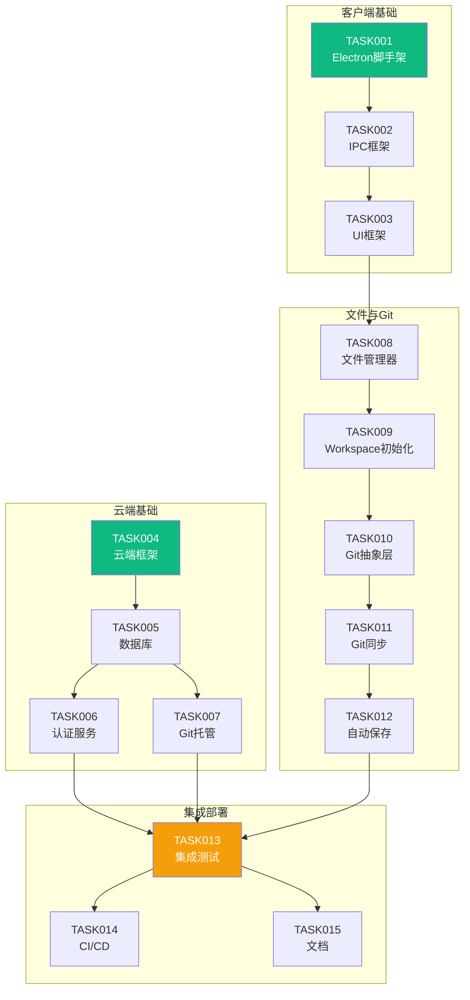

# Phase 0 - 基础设施搭建任务分解

> 本阶段目标：建立 Sibylla 项目的技术基础，验证核心技术选型可行性，跑通最小技术栈。

---

## 阶段概述

### 目标

建立 Sibylla 项目的技术基础设施，实现最小可运行链路：

1. ✅ Electron 应用能够启动并展示基础 UI
2. ✅ 本地文件系统读写正常工作
3. ✅ Git 基础操作（init/add/commit/push/pull）可用
4. ✅ 云端认证服务和 Git 托管服务基础可用
5. ✅ CI/CD 流水线能够自动构建和发布

### 里程碑定义

**Phase 0 完成标志：** 能够创建 workspace、编辑文件、自动 commit、push 到 Sibylla Git Host、另一台电脑 pull 下来看到变更。

### 范围

本阶段聚焦于技术基础设施搭建，不涉及复杂的业务逻辑和用户界面。所有功能以"能跑通"为标准，不追求完美的用户体验。

### 关键交付物

- Electron 桌面应用脚手架（Mac + Windows）
- 云端服务框架（Node.js + Fastify + PostgreSQL）
- Git 抽象层基础实现
- 文件系统操作封装
- CI/CD 自动构建流水线
- 基础技术文档

---

## 任务清单

### 第一组：客户端基础设施（并行开发）

| 任务 ID | 任务标题 | 优先级 | 复杂度 | 预估工时 | 状态 | 负责人 |
|---------|---------|--------|--------|----------|------|--------|
| [PHASE0-TASK001](phase0-task001_electron-scaffold.md) | Electron 应用脚手架搭建 | P0 | 中等 | 2-3 天 | ✅ 已完成 | AI |
| [PHASE0-TASK002](phase0-task002_ipc-framework.md) | IPC 通信框架实现 | P0 | 中等 | 1-2 天 | ✅ 已完成 | AI |
| [PHASE0-TASK003](phase0-task003_ui-framework.md) | 基础 UI 框架集成 | P0 | 简单 | 1-2 天 | 待开始 | 待分配 |

**依赖关系：** TASK001 → TASK002 → TASK003

### 第二组：云端基础设施（并行开发）

| 任务 ID | 任务标题 | 优先级 | 复杂度 | 预估工时 | 状态 | 负责人 |
|---------|---------|--------|--------|----------|------|--------|
| [PHASE0-TASK004](phase0-task004_cloud-service-framework.md) | 云端服务框架搭建 | P0 | 中等 | 2-3 天 | 待开始 | 待分配 |
| [PHASE0-TASK005](phase0-task005_database-initialization.md) | 数据库初始化与 Migration | P0 | 中等 | 1-2 天 | 待开始 | 待分配 |
| [PHASE0-TASK006](phase0-task006_auth-service.md) | 认证服务实现 | P0 | 复杂 | 2-3 天 | 待开始 | 待分配 |
| [PHASE0-TASK007](phase0-task007_git-hosting-setup.md) | Git 托管服务配置 | P0 | 复杂 | 2-3 天 | 待开始 | 待分配 |

**依赖关系：** TASK004 → TASK005 → TASK006, TASK007

### 第三组：文件系统与 Git 集成（依赖第一组）

| 任务 ID | 任务标题 | 优先级 | 复杂度 | 预估工时 | 状态 | 负责人 |
|---------|---------|--------|--------|----------|------|--------|
| [PHASE0-TASK008](phase0-task008_file-manager.md) | 文件管理器实现 | P0 | 中等 | 2-3 天 | 待开始 | 待分配 |
| [PHASE0-TASK009](phase0-task009_workspace-initialization.md) | Workspace 创建与初始化 | P0 | 中等 | 2-3 天 | 待开始 | 待分配 |
| [PHASE0-TASK010](phase0-task010_git-abstraction-basic.md) | Git 抽象层基础实现 | P0 | 复杂 | 3-4 天 | 待开始 | 待分配 |
| [PHASE0-TASK011](phase0-task011_git-remote-sync.md) | Git 远程同步实现 | P0 | 复杂 | 2-3 天 | 待开始 | 待分配 |
| [PHASE0-TASK012](phase0-task012_auto-save.md) | 自动保存机制实现 | P0 | 中等 | 1-2 天 | 待开始 | 待分配 |

**依赖关系：** TASK008 → TASK009 → TASK010 → TASK011 → TASK012

### 第四组：集成与部署（依赖所有前序任务）

| 任务 ID | 任务标题 | 优先级 | 复杂度 | 预估工时 | 状态 | 负责人 |
|---------|---------|--------|--------|----------|------|--------|
| [PHASE0-TASK013](phase0-task013_client-cloud-integration.md) | 客户端与云端集成测 | 2-3 天 | 待开始 | 待分配 |
| [PHASE0-TASK014](phase0-task014_cicd-pipeline.md) | CI/CD 流水线配置 | P1 | 中等 | 1-2 天 | 待开始 | 待分配 |
| [PHASE0-TASK015](phase0-task015_documentation.md) | 基础技术文档编写 | P1 | 简单 | 1-2 天 | 待开始 | 待分配 |

**依赖关系：** 所有前序任务 → TASK013 → TASK014, TASK015

---

## 任务依赖图



---

## 时间估算

### 总体估算

- **总任务数：** 15 个
- **总预估工时：** 28-40 工作日
- **建议团队规模：** 3-4 人
- **预计完成时间：** 2-3 周（并行开发）

### 关键路径

```
TASK001 → TASK002 → TASK003 → TASK008 → TASK009 → TASK010 → TASK011 → TASK012 → TASK013
```

关键路径总工时：**16-23 工作日**

### 并行开发建议

**第一周：**
- 开发者 A：TASK001 → TASK002 → TASK003
- 开发者 B：TASK004 → TASK005 → TASK006
- 开发者 C：TASK007（Git 托管配置）

**第二周：**
- 开发者 A：TASK008 → TASK009
- 开发者 B：TASK010 → TASK011
- 开发者 C：协助 TASK010/TASK011

**第三周：**
- 开发者 A：TASK012
- 开发者 B：TASK013
- 开发者 C：TASK014 → TASK015

---

## 风险与缓解

### 高风险任务

| 任务 | 风险 | 影响 | 缓解措施 |
|------|------|------|---------|
| TASK010 | isomorphic-git 学习曲线陡峭 | 高 | 提前技术预研，准备备选方案（nodegit） |
| TASK007 | Gitea 配置复杂 | 中 | 使用 Docker Compose 简化部署 |
| TASK013 | 集成问题多 | 高 | 每个任务完成后立即进行冒烟测试 |

### 技术债务控制

- 本阶段允许存在技术债务，但必须在代码中标注 `// TODO: Phase 1 优化`
- 所有 P0 任务必须有基础测试覆盖（≥ 60%）
- 所有公共接口必须有 TypeScript 类型定义

---

## 验收标准

### 功能验收

- [ ] 能够在 Mac 和 Windows 上启动 Electron 应用
- [ ] 能够创建 workspace 并生成标准目录结构
- [ ] 能够读写 Markdown 文件
- [ ] 文件修改后自动 commit
- [ ] 能够 push 到云端 Git 仓库
- [ ] 能够在另一台电脑 pull 下来看到变更
- [ ] 云端认证服务可用（注册/登录）
- [ ] CI/CD 能够自动构建 DMG 和 NSIS 安装包

### 质量验收

- [ ] 所有 P0 任务的单元测试覆盖率 ≥ 60%
- [ ] TypeScript strict mode 无错误
- [ ] ESLint 检查通过，无警告
- [ ] 关键路径有 E2E 测试覆盖
- [ ] 技术文档完整（README、API 文档、架构图）

### 性能验收

- [ ] 应用启动时间 < 3 秒
- [ ] IPC 调用延迟 < 50ms
- [ ] 文件读写延迟 < 100ms（< 1MB 文件）
- [ ] Git commit 操作 < 2 秒
- [ ] API 响应时间 < 200ms（P95）

---

## 参考文档

- [`CLAUDE.md`](../../../CLAUDE.md) - 项目宪法
- [`specs/design/architecture.md`](../../design/architecture.md) - 系统架构
- [`specs/requirements/phase0/infrastructure-setup.md`](../../requirements/phase0/infrastructure-setup.md) - 基础设施需求
- [`specs/requirements/phase0/file-system-git-basic.md`](../../requirements/phase0/file-system-git-basic.md) - 文件系统与 Git 需求

---

**创建时间：** 2026-03-01
**最后更新：** 2026-03-10
**阶段负责人：** 待分配
